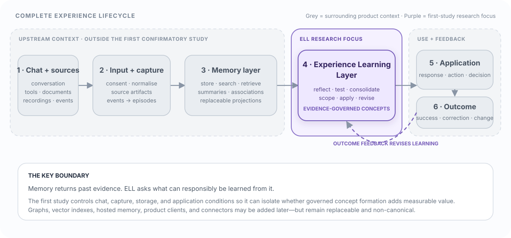

# Experience Learning Layer

**What if an AI could do more than remember what happened—and could learn a
careful, revisable lesson from it?**

The Experience Learning Layer (ELL) is an open research specification for
turning streams of experience into evidence-backed concepts that can improve
future decisions. It explores the missing step between an AI retrieving an old
conversation and an AI forming a useful principle from several related
experiences.

ELL does not treat a plausible summary as truth. It preserves the original
evidence, separates observations from interpretations, records the scope of
every learned concept, looks for counterexamples, and revises or retires a
concept when later outcomes disagree.

> **In one sentence:** memory helps an AI find the past; ELL investigates how an
> AI can learn from the past without losing evidence, uncertainty, or user
> control.

This repository is currently the **research publication and specification** for
ELL. It is not yet a production application or a validated learning engine.



## Why this matters

Most long-running AI systems have a growing memory problem. They can store more
messages, summaries, embeddings, and documents, but a larger archive does not
automatically produce better judgement. Retrieval can bring back five examples
of the same failure without extracting the reason they are related. A summary
can compress history while hiding exceptions. A confident model-generated
“insight” can become a durable mistake if nobody can trace or challenge it.

ELL is designed around a stronger standard for learning:

- **Transfer, not just recall.** A useful concept should help in a new situation
  that shares structure with earlier experiences, even when the wording differs.
- **Evidence, not unsupported certainty.** Every durable concept remains linked
  to the episodes that support or contradict it.
- **Scope, not overgeneralisation.** A lesson records where it applies, known
  exceptions, temporal validity, and calibrated confidence.
- **Revision, not silent rewriting.** Corrections and changed circumstances
  create a traceable new version instead of erasing history.
- **Outcomes, not intuition by assertion.** The system records when a concept was
  used and whether it actually helped.
- **Provider neutrality.** Models, databases, vector indexes, graphs, and hosted
  memory services can propose or retrieve candidates, but none becomes the
  authority for identity, policy, or canonical learning state.

If this works, an assistant could become more useful over time without becoming
an opaque profile of the user. It could understand shorthand, surface relevant
context at the right moment, adapt after corrections, explain the evidence
behind a suggestion, and forget information in a governed way.

## Memory is not the same as learning

Consider an agent that has seen three project launches run late after stakeholder
review began too late.

A memory system can retrieve the three launch records. A summariser might say
that stakeholder review was delayed. ELL asks whether there is enough diverse
evidence to propose a reusable concept, such as:

> For cross-functional launches with external dependencies, start stakeholder
> review before implementation is locked.

That statement is still not timeless truth. ELL would retain its supporting
episodes, conflicting cases, stated scope, confidence, version history, later
applications, and observed outcomes. A future counterexample might narrow the
concept, contest it, or retire it.

The intended progression is:

`episode → reflection → candidate → versioned concept → application → outcome → revision`

## Where ELL sits in the lifecycle

ELL is one layer in a larger product lifecycle. The surrounding layers are shown
in grey in the diagram because they are necessary to understand the system, but
they are **not the subject of the first confirmatory ELL study**.

| Lifecycle stage | Responsibility | First-study status |
|---|---|---|
| Chat and experience sources | Produce consented conversations, documents, recordings, tool traces, and application events | Context only; product capture UX and connectors are out of scope |
| Input and capture | Normalise source material into stable, permission-aware events and bounded episodes | Boundary schemas are specified; production ingestion is out of scope |
| Memory and retrieval | Persist history and return relevant episodes or candidate associations | Compared as baselines or replaceable infrastructure; not canonical learning |
| **Experience Learning Layer** | Reflect, test evidence, form scoped concepts, apply them, record outcomes, and revise them | **Core research focus** |
| Application and response | Use a compact intuition packet in a chat, workflow, agent action, or decision | Evaluation surface; product behaviour is out of scope |
| Outcome and feedback | Record success, failure, correction, change, and delayed consequences | Included only as governed evidence for evaluation and revision |

The research begins at a controlled boundary: a canonical stream of consented
experience records already exists. It does not prescribe how an app captures a
screen, records a meeting, connects a calendar, or designs a chat interface.
Those systems may eventually feed ELL, but including them in the first experiment
would make it impossible to tell whether any improvement came from the learning
layer or from better capture, retrieval, or product design.

Likewise, ELL sits **after ordinary memory and retrieval**. A vector index,
temporal graph, full-text store, or hosted memory service may help find evidence,
but it remains a replaceable projection. It cannot directly declare a concept
true, override permissions, discard counterevidence, or silently mutate canonical
state.

## What ELL-Core actually studies

The confirmatory system is deliberately small. ELL-Core defines seven durable
objects plus an audit trail:

| Object | Question it answers |
|---|---|
| `SourceArtifact` | What exact source and permitted span did this come from? |
| `Episode` | What happened, in what context, and when was it observed? |
| `Reflection` | What provisional interpretation or question did the evidence suggest? |
| `ConceptVersion` | What reusable claim is proposed, with what scope and validity? |
| `EvidenceLink` | Which evidence supports, contradicts, or qualifies the concept? |
| `ApplicationReceipt` | Where was the concept used, under which policy and budget? |
| `Outcome` | Did the application help, fail, or reveal a change? |
| `AuditEvent` | Who or what performed each governed lifecycle operation? |

Models may propose interpretations. Deterministic validation and policy decide
whether those proposals are rejected, held for review, or committed. A compact
**intuition packet** can then supply a later decision with the smallest useful
set of concepts, evidence, uncertainty, and counterevidence under a fixed context
budget.

“Intuition” here is a product capability, not a claim about consciousness or a
new memory type. It means useful generalisation, relevance selection, adaptation,
and explanation emerging from an evidence-governed learning loop.

## Potential use cases

ELL is intended as shared infrastructure for many kinds of long-running AI
systems rather than as a chatbot of its own.

- **Personal assistants:** learn scoped preferences and routines while preserving
  exceptions, consent, provenance, and correction history.
- **Project copilots:** identify recurring delivery risks across projects and
  surface a relevant lesson before the same failure repeats.
- **Customer-support agents:** learn which resolution strategies work for which
  issue classes without turning one unusual case into a universal rule.
- **Engineering agents:** retain outcomes from builds, reviews, incidents, and
  deployments and reuse validated strategies in structurally similar work.
- **Research assistants:** distinguish source evidence from interpretation and
  revise working hypotheses as counterevidence arrives.
- **Team and organisational memory:** form shared, inspectable operational
  knowledge without making a vendor-specific memory store the source of truth.
- **Education and coaching:** adapt guidance from observed outcomes while keeping
  the learner’s history, uncertainty, and changing needs visible.
- **Safety-sensitive automation:** require evidence, permission, scope, and
  application receipts before learned guidance can affect an action.

These are potential applications, not claims of demonstrated performance. The
research plan is designed to discover whether the core mechanism earns the right
to support them.

## Research question and success standard

The primary question is intentionally falsifiable:

> Under matched models, experience streams, context budgets, and total compute,
> does an evidence-governed concept layer improve success on structurally related
> but lexically different tasks over the strongest eligible non-parametric
> baseline?

The target improvement is at least five percentage points. That result counts as
support only if ELL also passes preregistered gates for scope safety, evidence
quality, adaptation, cost, governance, and replication. If a simpler retrieval,
summary, or direct-insight baseline performs as well at lower cost, the concept
layer is not justified for the tested conditions.

The exact thresholds and rejection rules are defined in
[Definition of Success and Falsifiability](chapters/11-expected-outcomes-and-falsifiability.qmd).

## Research and implementation phases

The project advances in evidence-producing phases. A phase is complete only when
its artefacts and exit criteria are reproducible; writing code alone does not
count as validation.

| Phase | Goal | Exit signal |
|---|---|---|
| **0 — Freeze the research contract** | Publish the paper, schemas, hypotheses, baselines, metrics, and rejection conditions | An independent reader can identify what would support or reject ELL |
| **1 — Build the benchmark first** | Create deterministic experience streams, sealed splits, receipts, and strong simple baselines | Clean-machine runs reproduce data and baseline results |
| **2 — Implement deterministic ELL-Core** | Test lifecycle, provenance, time, deletion, idempotency, and workspace isolation without an LLM | Every derived object resolves to permitted source evidence |
| **3 — Add model-assisted learning** | Quarantine and validate model-generated reflections, concepts, merges, splits, and revisions | A sealed run completes with full evidence, outcome, and cost traces |
| **4 — Run the confirmatory study** | Compare frozen ELL-Core against the strongest eligible baseline | Publish a supported, partial, unsupported, or unsafe verdict |
| **5 — Test replaceable substrates** | Compare SQLite, lexical search, vectors, TurboVec, and external-memory adapters | Changing infrastructure does not change canonical semantics |
| **6 — Test external validity and a pilot** | Evaluate external benchmarks and a small consented product experience | Benefits transfer without safety regressions and users retain control |
| **7 — Test governed self-scaffolding** | Compare frozen learning strategies with versioned, bounded scaffold mutations | A better scaffold wins time-forward at equal cost with no governance regression and reproducible rollback |

The repository now contains a **Phase 0 freeze candidate, executable Phase 1–2
reference slices, and evidence-gated Phase 4–6 research tooling**. The machine-readable contract, deterministic
stream generator, seven simple baselines, immutable receipts, and in-memory
ELL-Core are implemented and covered by contract tests. The confirmatory runner,
substrate conformance suite, external-package validators, and pilot consent gates
are also executable. This is implementation evidence, not a benchmark result:
Phase 0 still needs an immutable release,
Phase 1 still needs independent clean-machine reproduction, and Phase 2 still
needs broader property/adversarial coverage. Phase 4 is blocked by the missing
Phase 3 evidence, Phase 5 is not yet contractually eligible, and Phase 6 has run
no external package or human pilot. Phase 7 is a research specification only; no
self-scaffolding controller or result exists.

## Deliberately outside the first study

The broader lifecycle matters, but the following work is deliberately deferred
so the core claim can be attributed and falsified cleanly:

- chat interfaces, screen or sensor perception, recordings, and production
  connectors;
- multimodal ingestion and large-scale identity resolution;
- graph databases and graph visualisation as a product surface;
- approximate vector infrastructure and hosted memory providers;
- governed self-scaffolding, other learned memory-operation policies, and
  autonomous skill evolution;
- neural or parametric memory and model fine-tuning;
- cross-device sync and production deployment;
- a polished end-user client.

These are not rejected ideas. They are later experiments. Graphs in particular
may become useful association or inspection projections, but ELL does not require
a graph database and a graph must never become the only place where evidence,
identity, permissions, or deletion state exists.

Self-scaffolding is now an explicit Phase 7 research track rather than an
unspecified aspiration. It may learn bounded reflection, consolidation,
retrieval, budget, retry, and abstention strategies, while deterministic ELL
governance remains the sole authority over evidence and canonical state.

## How to use this repository today

There are four useful ways to engage with the project now:

1. **Read the research argument.** Start with the
   [abstract](index.qmd), [problem definition](chapters/02-problem-definition.qmd),
   [architecture](chapters/04-experience-learning-layer-architecture.qmd), and
   [success criteria](chapters/11-expected-outcomes-and-falsifiability.qmd).
2. **Review or challenge the specification.** Inspect the proposed data model,
   lifecycle rules, algorithms, threats to validity, and stop conditions. Issues
   that make the hypothesis easier to falsify are especially valuable.
3. **Edit and render the publication.** The canonical source is ordinary Quarto
   Markdown, so the website and PDF are generated from the same reviewable text.
4. **Reproduce the deterministic artifact.** Generate the JSON Schemas, run the
   benchmark baselines, and exercise ELL-Core without an LLM or external service.

The synthetic cases in [`examples/golden-cases.jsonl`](examples/golden-cases.jsonl)
illustrate correction, contradiction, temporal change, unsupported claims,
sensitive inference, multilingual evidence, and prompt injection. They are
examples—not benchmark results or proof that ELL works.

## Verify the Phase 0–2 reference artifact

Install the development dependencies into an isolated environment, then run the
complete local verification gate:

```bash
python3 -m pip install -e '.[dev]'
make verify
```

`make verify` regenerates all 33 Draft 2020-12 JSON Schemas, checks lint and
strict typing, and runs deterministic contract and adversarial tests. To produce
development benchmark artifacts without opening the sealed partition:

```bash
make benchmark-development SEALED_COMMITMENT=sha256:<committed-seed-digest>
```

Opening the sealed partition requires the committed seed explicitly and should
only happen after the implementation, prompts, models, policies, and analysis
configuration are frozen:

```bash
PYTHONPATH=src python3 -m ell.benchmark \
  --partition sealed \
  --sealed-seed <revealed-seed> \
  --output artifacts/benchmark-sealed
```

## Read, edit, and render the paper

[`index.qmd`](index.qmd) and the files in [`chapters/`](chapters/) are the only
canonical publication source. Install [Quarto](https://quarto.org/docs/get-started/)
and its TinyTeX PDF engine, then start a local preview:

```bash
quarto preview
```

Build the complete website and PDF without starting a preview server:

```bash
quarto render
```

Generated files are written to `_book/` and intentionally ignored by Git. The
GitHub workflow publishes that output to GitHub Pages after changes merge to
`main`.

The production Vercel edition is available at
[experience-learning-layer.vercel.app](https://experience-learning-layer.vercel.app).
Publish a locally verified version with:

```bash
./script/deploy_vercel.sh
```

The deployment script renders both formats, verifies the HTML entry point, PDF,
chapter navigation, and Quarto navigation asset, then uploads only `_book/` as
the Vercel deployment root. It never publishes the Quarto sources, TeX
intermediates, or local logs. `ELL_QUARTO_BIN`, `ELL_VERCEL_BIN`,
`ELL_VERCEL_PROJECT`, and `ELL_VERCEL_SCOPE` can override local tool paths or
the target project when needed. Automatic Vercel Git deployments are disabled
in [`vercel.json`](vercel.json): Vercel does not provide this publication's
Quarto and TinyTeX build environment, and serving the repository root would
publish `.qmd` sources as downloads instead of the rendered book.

## Repository map

| Path | Purpose |
|---|---|
| [`index.qmd`](index.qmd) | Abstract and publication status |
| [`chapters/`](chapters/) | Canonical editable paper chapters |
| [`chapters/04-experience-learning-layer-architecture.qmd`](chapters/04-experience-learning-layer-architecture.qmd) | Core architecture and concept lifecycle |
| [`chapters/07-experimental-design.qmd`](chapters/07-experimental-design.qmd) | Benchmark and evaluation design |
| [`chapters/12-research-and-implementation-roadmap.qmd`](chapters/12-research-and-implementation-roadmap.qmd) | Detailed Phase 0–6 roadmap |
| [`chapters/13-experience-learning-layer-expansion.qmd`](chapters/13-experience-learning-layer-expansion.qmd) | Broader product horizon and deferred layers |
| [`chapters/14-research-artifact-status.qmd`](chapters/14-research-artifact-status.qmd) | Current implementation boundary |
| [`chapters/assets/diagrams/`](chapters/assets/diagrams/) | Shared web and print diagrams |
| [`examples/`](examples/) | Synthetic lifecycle examples |
| [`research/research-contract-v0.6.json`](research/research-contract-v0.6.json) | Frozen estimand, gates, power assumptions, baseline selection, and analysis rules |
| [`schemas/v0.6/`](schemas/v0.6/) | Generated canonical and benchmark JSON Schemas plus digest manifest |
| [`src/ell/benchmark.py`](src/ell/benchmark.py) | Deterministic 50/200/1,000-event streams, sealed split handling, baselines, receipts, and manifests |
| [`src/ell/core.py`](src/ell/core.py) | In-memory deterministic ELL-Core lifecycle and governance authority |
| [`tests/`](tests/) | Reproducibility, contract, lifecycle, and adversarial evidence |
| [`src/ell/study.py`](src/ell/study.py) | Frozen Phase 4 gates, comparator selection, and verdict logic |
| [`src/ell/substrates.py`](src/ell/substrates.py) | SQLite/in-memory canonical conformance and rebuildable projections |
| [`src/ell/external.py`](src/ell/external.py) | Hash- and licence-declared external benchmark package adapters |
| [`src/ell/pilot.py`](src/ell/pilot.py) | Consent, egress, withdrawal, and pilot-readiness authority |
| [`research/PHASE4_STATUS.md`](research/PHASE4_STATUS.md) | Confirmatory readiness and blockers |
| [`research/PHASE5_STATUS.md`](research/PHASE5_STATUS.md) | Substrate conformance scope and remaining adapters |
| [`research/PHASE6_STATUS.md`](research/PHASE6_STATUS.md) | External benchmark and consented-pilot boundary |
| [`_quarto.yml`](_quarto.yml) | Publication metadata and build configuration |
| [`.github/workflows/publish.yml`](.github/workflows/publish.yml) | GitHub Pages publication workflow |

## Design principles

- Canonical evidence is immutable; interpretations are revisable.
- A model proposes; deterministic services validate, authorise, version, and
  commit.
- Confidence comes from evidence and outcomes, not model eloquence.
- Counterevidence is a first-class input, not inconvenient context to discard.
- Permissions and workspace boundaries are applied before relevance ranking.
- Stores, indexes, graphs, and providers are replaceable projections.
- Every learned object must remain inspectable, correctable, and deletable.
- The simplest method that passes the gates should win.

## License

The paper, schemas, reference implementation, tests, diagrams, examples, and publishing configuration are available under
the [MIT License](LICENSE).
