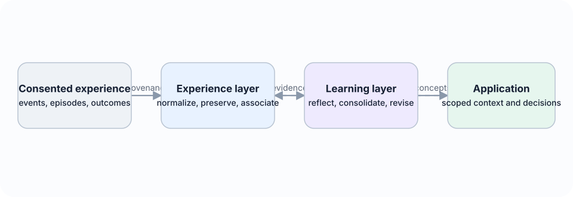
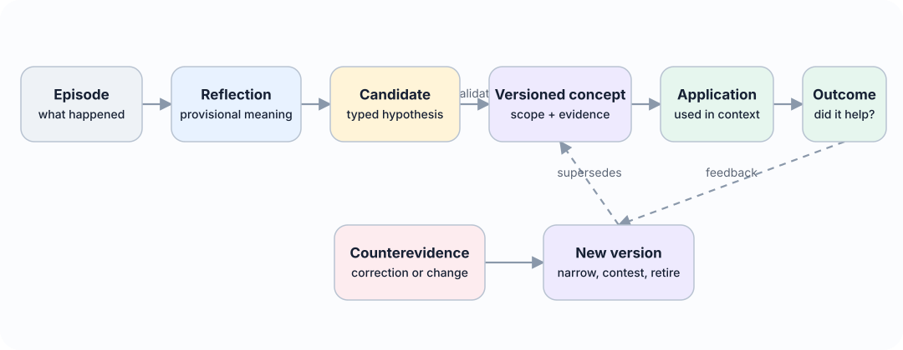
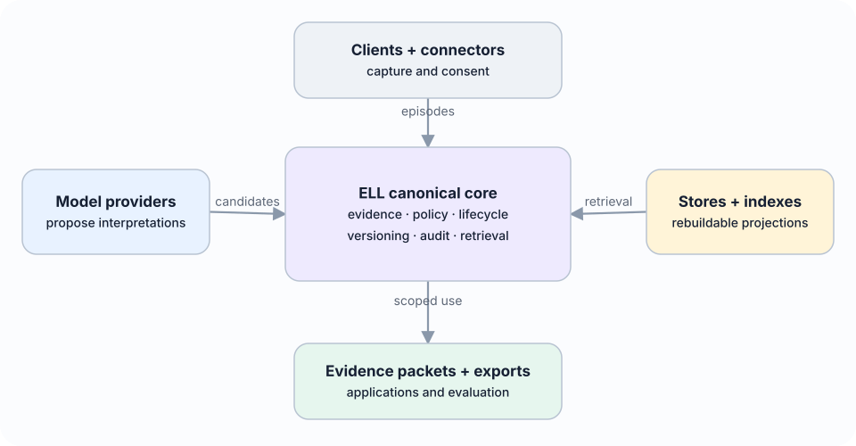

# Experience Learning Layer

**From episodes to revisable concepts: an open research specification for
evidence-grounded learning in language agents.**

Large language models can retrieve old interactions without learning anything
general from them. The Experience Learning Layer (ELL) asks what must happen
between remembering an event and earning a reusable concept: preserving exact
evidence, proposing an interpretation, testing its scope, applying it later, and
revising it when outcomes or counterexamples disagree.



## Read the paper

- **[HTML reading edition](docs/index.html)** — navigable, responsive pages for
  reading and sharing;
- **[Current PDF](output/pdf/Experience-Learning-Layer-Paper-current.pdf)** — the
  reproducible paper artifact;
- **[Markdown manuscript](paper/ELL_Paper.md)** — the canonical living source.

The `docs/` directory is ready to serve as a GitHub Pages site.

## The core idea

ELL is not another vector database or conversation-history feature. It is a
provider-neutral learning layer positioned between consented experience and an
agent's future decisions.

1. **Episodes** preserve what happened in a bounded context.
2. **Reflections** hold provisional interpretations, including uncertainty.
3. **Concepts** are versioned, scoped claims supported by evidence and tested
   against counterevidence.
4. **Applications and outcomes** show whether a concept helped in a later
   situation.
5. **Revision** creates a new version; it never silently overwrites history.



Models may interpret meaning, but deterministic code controls validation,
authority, lifecycle, correction, forgetting, and commit operations.


## Paper contents

| Section | Focus |
|---|---|
| [Abstract](docs/index.html) | Proposal, hypothesis, and research status |
| [1. Introduction](docs/paper/01-introduction.html) | Why retrieval is not learning |
| [2. Problem Definition](docs/paper/02-problem-definition.html) | Failure modes, research questions, hypotheses |
| [3. Related Work and Positioning](docs/paper/03-related-work-and-positioning.html) | Memory, reflection, skills, and continual learning |
| [4. ELL Architecture](docs/paper/04-experience-learning-layer-architecture.html) | Episodes, associations, reflections, concepts, outcomes |
| [5. Proposed Algorithms](docs/paper/05-proposed-algorithms.html) | Scheduling, critique, consolidation, revision |
| [6. Data Model and Interfaces](docs/paper/06-data-model-and-public-interfaces.html) | Entities, states, contracts, storage independence |
| [7. Experimental Design](docs/paper/07-experimental-design.html) | Baselines, metrics, ablations, falsifiability |
| [8. Open-Source Reference](docs/paper/08-open-source-reference-implementation.html) | Repository and reproducibility contract |
| [9. Ethics, Privacy, and Security](docs/paper/09-ethics-privacy-and-security.html) | Consent, provenance, deletion, sensitive inference |
| [10. Limitations](docs/paper/10-limitations-and-threats-to-validity.html) | Boundaries and threats to validity |
| [11. Expected Outcomes](docs/paper/11-expected-outcomes-and-falsifiability.html) | What would support or reject the proposal |
| [12. Roadmap](docs/paper/12-research-and-implementation-roadmap.html) | Research-first delivery sequence |
| [13. Expanded Architecture](docs/paper/13-experience-learning-layer-expansion.html) | Provider-neutral topology and plural memory |
| [14. Implementation Status](docs/paper/14-reference-implementation-status.html) | What is implemented and what remains |
| [15. Conclusion](docs/paper/15-conclusion.html) | The claim and immediate next step |
| [References](docs/paper/references.html) | Primary literature |

## What is in this repository

| Path | Purpose |
|---|---|
| `paper/` | Canonical manuscript and PDF/HTML builders |
| `docs/` | Generated HTML reading edition, diagrams, and architecture notes |
| `schemas/` | Versioned public boundary schemas |
| `evals/golden/` | Synthetic, versioned evaluation cases |
| `src/ell/domain/` | Small executable examples of policy and lifecycle invariants |
| `tests/` | Contract and kernel tests supporting implementation claims |
| `output/pdf/` | Current reproducible PDF |

The code is deliberately a research reference, not a product or hosted service.
Databases, model providers, vector indexes, and clients remain replaceable adapters
outside the canonical learning model.



## Build and verify

```bash
make install
make paper      # PDF + HTML + SVG diagrams
make check      # lint + typecheck + tests + generated-site checks
```

The current reference kernel runs offline with deterministic fixtures. The paper
does not claim empirical results for its research hypotheses; those results will be
added only when the benchmark and evaluation harness can reproduce them.

## License

Experience Learning Layer is open-source software available under the
[MIT License](LICENSE).
