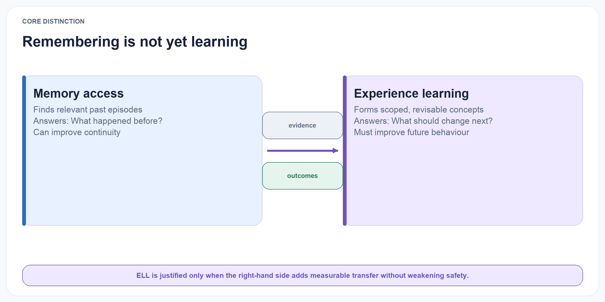
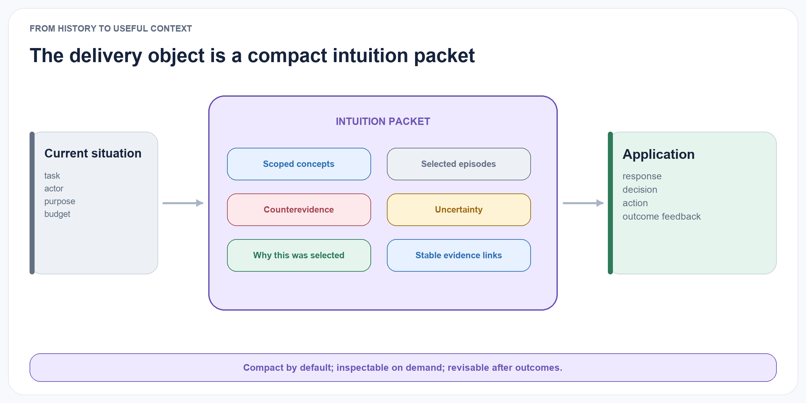

# Introduction

A language agent can remember an earlier event without learning anything general from it. A retrieval system may surface five examples of the same failure, yet the agent may still repeat that failure because the episodes have never been converted into a reusable and appropriately scoped principle. This distinction matters as agents move from single-turn assistance toward persistent collaboration, long-running tasks, and multi-session interaction.

The intended user experience is stronger than factual continuity. An AI should understand conversational shorthand, surface relevant context just in time, generalise usefully across related situations, notice when a previous pattern has changed, correct itself rapidly, and express calibrated uncertainty. Explanations should be available when requested without forcing provenance detail into every interaction. These behaviours constitute the proposed operational meaning of an evolving intuition; they do not imply consciousness, personhood, or a simulation of human cognition.

{#fig-memory-vs-learning fig-alt="Memory access retrieves relevant past episodes, while experience learning forms scoped revisable concepts and measures their future outcomes." width="100%"}

The first generation of agent-memory systems established that external memory could improve continuity beyond a model’s context window. Generative Agents stored observations, ranked them for retrieval, and periodically synthesised higher-level reflections that influenced later plans (Park et al. 2023). Reflexion used textual feedback about prior attempts as a non-parametric learning signal (Shinn et al. 2023). ExpeL extracted natural-language insights from collections of task experiences and reused both insights and successful trajectories at inference time (Zhao et al. 2024). MemGPT approached the problem as virtual context management, allowing an agent to move information between limited working context and external storage (Packer et al. 2023). CoALA organised these developments within a broader cognitive architecture containing working, episodic, semantic, and procedural memory (Sumers et al. 2024).

Subsequent systems have increasingly abstracted experience rather than merely retrieving it. Voyager accumulated reusable executable skills (G. Wang et al. 2023). Agent Workflow Memory induced recurring action routines from prior trajectories (Z. Z. Wang et al. 2025). A-MEM dynamically linked and revised memory notes as new information arrived (Xu et al. 2025). Reflective Memory Management used prospective and retrospective reflection to improve memory granularity and retrieval (Z. Tan et al. 2025). Hindsight separates world, experience, observation, and opinion networks and allows opinions to evolve with confidence (Latimer et al. 2026). More recent architectures explicitly construct schemas, concepts, semantic knowledge, or procedural knowledge from episodes, including DCPM, GAAMA, and PlugMem (Fei et al. 2026; Paul, Sharma, and Sareen 2026; Yang et al. 2026). A recent survey describes this field-wide progression as storage, reflection, and experience abstraction (Luo et al. 2026).

This rapid progress changes the research question. It is no longer defensible to claim that transforming episodes into abstractions is itself novel. Nor are provenance, non-monotonic belief revision, temporal validity, or dependency-based retraction new in isolation. The more precise question is: Does combining these ideas in an external language-agent learning layer produce a measurable advantage over simpler memory methods, and can that advantage survive explicit safety, adaptation, and cost constraints?

ELL addresses this question by separating four objects that are often collapsed into one textual memory:

1. An episode records what occurred in a specific context.
2. A reflection is a provisional interpretation of one or more episodes.
3. A concept is a reusable proposition or strategy supported by multiple reflections and episodes.
4. An application outcome records whether using a concept helped in a later situation.

The separation is important because a plausible explanation is not automatically reliable knowledge. Suppose a project proposal is rejected after stakeholders were consulted late. A reflection may state that late stakeholder involvement caused the rejection. That is a useful hypothesis, but a single episode does not justify a universal rule. A concept should only be promoted after corroborating cases, explicit checks for counterexamples, and a scope statement such as “cross-functional initiatives with external implementation dependencies.” New evidence may later narrow, challenge, or replace it.

ELL treats every concept as a versioned claim rather than a timeless fact. The system retains the episodes that support it, episodes that contradict it, the contexts in which it has been applied, and the outcomes of those applications. This makes concept formation inspectable and enables evaluation at the level where learning is claimed to occur.

The architecture is inspired by, but does not attempt to reproduce, human memory. Tulving’s distinction between episodic and semantic memory motivates the separation between event-specific records and general knowledge (Tulving 1972). Complementary Learning Systems theory motivates a fast episodic path and a slower consolidation path that integrates common structure across experiences (McClelland, McNaughton, and O’Reilly 1995; Kumaran, Hassabis, and McClelland 2016). Bartlett’s account of reconstructive remembering provides a warning as much as an inspiration: abstraction can impose existing schemas on ambiguous experience and thereby distort it (Bartlett 1932). For this reason, ELL preserves provenance, counterevidence, and reversible revisions.

## Scope

ELL is an external learning layer. It does not update the parameters of the underlying language model. It does not prescribe how raw activity is captured from calendars, files, screens, sensors, or chat applications. It starts after an application has produced a canonical stream of consented experience records. It is designed to support conversation histories, task trajectories, product-work records, and other event streams through a shared schema.

The confirmatory research scope is deliberately narrower than a complete personal-intelligence system. ELL-Core contains only source evidence, episodes, provisional reflections, versioned concepts, evidence links, application receipts, and outcomes. It focuses on:

- association between episodes;
- reflection over individual and grouped episodes;
- concept formation and consolidation;
- application of concepts to later decisions;
- revision after new evidence and outcomes;
- direct evaluation of concept quality and transfer.

{#fig-intuition-packet fig-alt="A current situation enters an intuition packet with concepts, episodes, counterevidence, uncertainty, selection reasons, and evidence links before an application records outcome feedback." width="100%"}

Perception, multimodal capture, large-scale identity resolution, autonomous skill evolution, learned memory-operation policies, neural memory, production provider integrations, and parametric fine-tuning are outside the first confirmatory study. Governed self-scaffolding is nevertheless specified as a first-class follow-on programme: ELL may eventually learn versioned strategies for reflection, consolidation, retrieval, and error recovery, but only after ELL-Core clears its success gates and without granting a learned strategy authority over evidence, consent, permissions, deletion, or canonical commits.

## Contributions

This working paper specifies six intended contributions.

A minimal experience-to-concept contract. It defines distinct schemas and operations for evidence, episodes, reflections, concepts, applications, and outcomes without requiring a graph, vector database, or hosted memory provider.

An evidence-grounded concept lifecycle. Concepts move through explicit states—proposed, corroborated, contested, revised, superseded, and retired—while retaining lineage and provenance.

A separation between confidence and eloquence. Concept confidence is computed from observable evidence, contradiction, diversity, and outcome history rather than accepted directly from an LLM’s self-reported certainty.

A confirmatory evaluation protocol. One primary transfer outcome is paired with preregistered epistemic, adaptation, governance, and cost guardrails. Component metrics diagnose why the result occurred; they do not substitute for behavioural improvement.

An evaluation-first open implementation plan. The benchmark and simple baselines are built before the concept engine. Versioned releases will include schemas, prompts, configurations, generators, evaluation scripts, raw receipts, and paper sources under permissive licences, with reproducibility runs using open-weight models.

A governed self-scaffolding research programme. A slower meta-learning loop treats the strategy used to learn and apply concepts as a typed, versioned, replayable object. Candidate strategies must beat a frozen policy under matched conditions, pass immutable governance gates, survive shadow and canary evaluation, and retain a complete rollback path before promotion.
