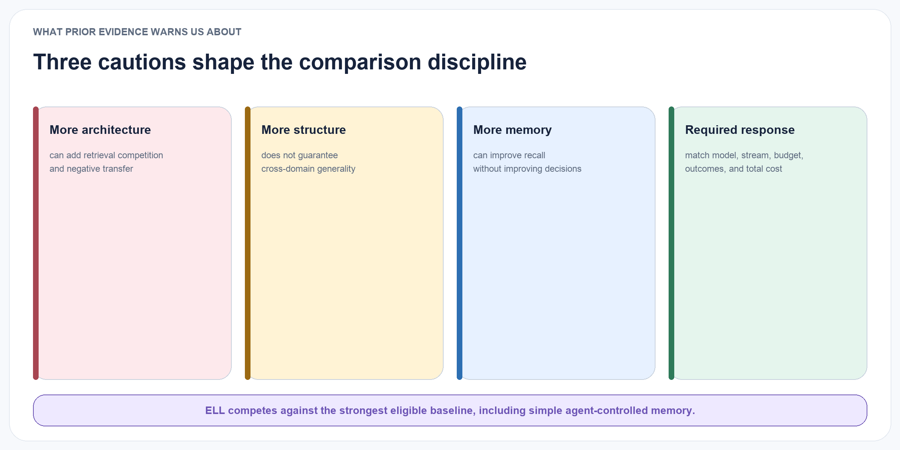
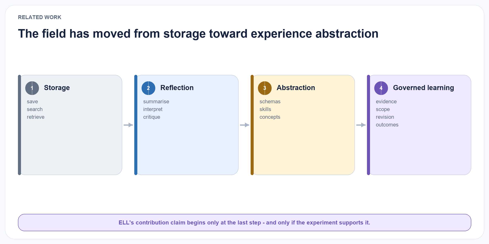
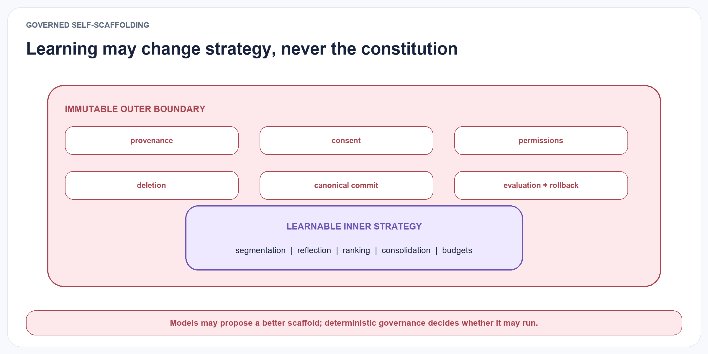

# Related Work and Positioning

{#fig-research-landscape fig-alt="A landscape places ELL-Core at the high-abstraction, high-evidence-control end of a progression from context management through retrieval, reflection, schemas, and skills." width="100%"}

## Production memory and context infrastructure

Production-oriented systems establish useful implementation patterns without settling ELL's epistemic model.

MemGPT, now developed as Letta, treats a finite context window as a managed hierarchy and gives the agent explicit operations for moving information between tiers (Packer et al. 2023; Letta 2026). Mem0 provides a developer-facing memory layer that extracts, consolidates, and retrieves salient conversational information, with an optional graph representation (Chhikara et al. 2025). Zep and its open-source Graphiti engine maintain temporally valid entities and relations, preserve episode provenance, and combine semantic, lexical, and graph retrieval (Rasmussen et al. 2025; Zep 2026). Hindsight separates world, experience, observation, and opinion networks, combining vector, keyword, graph, and temporal retrieval with evolving confidence-bearing opinions (Latimer et al. 2026).

TencentDB Agent Memory has expanded from layered conversational memory into a team-oriented memory hub. Its public design includes L0 conversations, L1 atoms, L2 scenarios, and L3 core or persona representations, alongside versioned skills, Wiki, CodeGraph, ownership, status, visibility, agent bindings, access-control lists, and budgeted BM25, vector, and reciprocal-rank-fusion retrieval (TencentDB Agent Memory Team 2026). These features overlap with several earlier ELL design goals. TencentDB must therefore be treated as a substantive comparison system, not described merely as a raw-memory store.

TurboVec belongs at a different layer. It is a local compressed vector index built on TurboQuant, with online ingestion and query-time allow-list filtering; it does not define memory semantics, concept lifecycle, or learning policy (Shukla, Pandey, and Tiwari 2026). ELL may evaluate it as a `RetrievalCandidateProvider` against exact search, HNSW, and other approximate indexes, but it is not an end-to-end memory-system baseline.

ELL adopts four principles from this family: explicit context-budget management; incremental temporal updates; hybrid candidate retrieval; and a drill-down path from compact context to source episodes. The corresponding integration points are replaceable ContextManager, MemoryProjection, TemporalRelationIndex, and RetrievalCandidateProvider ports. It rejects the assumption that any provider's extracted fact, persona, graph edge, summary, or context block is canonical truth. Such outputs enter ELL as untrusted candidates and remain subject to evidence, workspace, permission, version, deletion, and commit policy.

These projects are comparatively mature as deployable software, but their public evaluations use different models, prompts, budgets, datasets, and product configurations. Vendor- or project-reported latency, token, and accuracy results therefore motivate reproduction; they are not evidence that one substrate should be adopted as ELL's governing architecture. The present ELL proposal has not integrated or validated any of these systems end to end.

## Empirical cautions for ELL

{#fig-empirical-cautions fig-alt="Three cautions show that more architecture, structure, or memory may not improve learning, followed by a requirement for matched comparisons." width="100%"}

Recent evidence argues against assuming that more elaborate memory architecture implies better learning. A 2026 survey places cross-trajectory abstraction at the frontier of a broader storage–reflection–experience progression, making abstraction a field direction rather than an ELL-specific novelty (Luo et al. 2026). Sequential-task experiments further show that external memory relocates rather than removes the continual-learning problem: abstract procedures can improve forward transfer while retrieval competition and negative transfer harm hard cases (Hu, Long, and Wang 2026).

{#fig-learning-spectrum fig-alt="A four-step spectrum progresses from storage to reflection to abstraction to governed learning." width="100%"}

Cross-scenario comparisons report that a self-managed flat-file agent harness can rank above more specialised memory systems, which challenges the assumption that a fixed structured store will generalise across dialogue, code, search, and long-horizon tasks (Chen et al. 2026). Controlled analysis of graph and non-graph dialogue memory likewise finds that implementation details and strong simple baselines can matter as much as the graph abstraction itself (S. Hu et al. 2026). These findings require ELL to earn every layer through ablation. Graph association, learned memory operations, and specialised indexes remain optional conditions until they beat a simple baseline under the same evidence and cost budget.

Trustworthiness is also a retrieval problem, not only a write problem. Semantically related memory can be inappropriate for the current task and can create cross-domain leakage, sycophancy, tool drift, or memory-induced prompt attacks (J. Zhang et al. 2026). ELL therefore treats retrieval as a policy-bound admission decision and measures both relevant inclusion and harmful inclusion.

## Reflection, reasoning memory, and non-parametric learning

Generative Agents introduced periodic reflection over accumulated observations, producing higher-level statements that could themselves be retrieved (Park et al. 2023). Reflexion showed that verbal feedback stored in episodic memory can improve repeated task attempts without weight updates (Shinn et al. 2023). ExpeL extended this idea by extracting insights across training experiences and transferring them to test tasks (Zhao et al. 2024). ReasoningBank distils strategies from both successful and failed trajectories and combines them with memory-aware test-time scaling (Ouyang et al. 2026). Reflective Memory Management used forward-looking summarisation and backward-looking evidence-based retrieval refinement (Z. Tan et al. 2025).

These systems establish reflection as a useful learning operator. ELL adopts that operator but makes a stricter distinction: a reflection is a candidate interpretation, not yet a trusted concept. This distinction enables explicit evidence thresholds, counterevidence checks, and lifecycle transitions. Self-judged success or failure is useful as one outcome signal but cannot be the sole authority for canonical learning; independent validators, task rewards, user corrections, and uncertainty must be retained where available.

## Semantic, procedural, and graph-based abstraction

A second line of work converts experience into structured knowledge or reusable procedures. Voyager stores executable skills; Agent Workflow Memory induces reusable task routines; and A-MEM dynamically organises memory notes through contextual attributes and links (G. Wang et al. 2023; Z. Z. Wang et al. 2025; Xu et al. 2025). Temporal Semantic Memory aggregates temporally continuous evidence into durative user representations (Su et al. 2026).

The closest recent systems move explicitly from episodes to abstractions. DCPM separates fast fact updates from slower induction of schemas, intentions, and cross-domain patterns, with evidence links to supporting facts (Fei et al. 2026). GAAMA constructs a typed graph with episode, fact, reflection, and concept nodes (Paul, Sharma, and Sareen 2026). PlugMem derives semantic and procedural knowledge graphs from standardised episodic traces and maintains provenance to source episodes (Yang et al. 2026).

ELL is complementary to these architectures rather than a claim to precede them. Its intended distinction is the epistemic lifecycle of a concept. The core research object is not only a graph node or summary, but a claim with:

- separate supporting and contradicting evidence;
- an explicit applicability scope;
- a confidence calculation based on observable signals;
- temporal validity and version lineage;
- recorded downstream applications and outcomes;
- direct concept-level evaluation.

The implementation can use a graph, relational database, vector index, or a combination. The contribution is the contract and lifecycle, not a requirement for one storage technology.

## Learned memory-operation policies

AgeMem exposes store, retrieve, update, summarise, and discard as tool actions and learns a unified short- and long-term memory policy with progressive reinforcement learning (Y. Yu et al. 2026). AtomMem decomposes management into atomic create, read, update, and delete operations and learns their orchestration with supervised and reinforcement learning (Huo et al. 2026). MemSkill instead represents extraction, consolidation, and pruning as reusable skills selected by a controller and revised by a designer that examines hard cases (H. Zhang et al.

2026).

ELL adopts the separation between atomic operations and policy, adaptive operation selection, and explicit learning from policy failures. These map to versioned MemoryOperationPolicy, ExtractionPolicy, ConsolidationPolicy, RetrievalPolicy, and ForgettingPolicy ports. A fixed heuristic and a learned policy should be interchangeable under the same typed inputs, outputs, budgets, and audit traces.

The rejected assumption is that task reward alone grants authority to mutate durable memory. Reward design can favour short-term benchmark success, opaque policies can make a write difficult to explain, and update or delete actions can destroy evidence needed for correction and scientific audit. ELL therefore permits learned policies to propose operations, but deterministic services enforce append-only provenance, authorization, idempotency, workspace isolation, tombstones, and canonical commit. These methods are recent research systems evaluated on bounded benchmark suites; their transfer, reward robustness, and deletion safety remain experimental questions.

## Self-scaffolding and learned orchestration

{#fig-policy-boundary fig-alt="A nested boundary places learnable strategies inside immutable provenance, consent, permission, deletion, commit, evaluation, and rollback controls." width="100%"}

Ornith-1.0 extends policy learning from task solutions to the harness that produces them. At each reinforcement-learning step, the model first refines a task-specific scaffold from the task and its previous scaffold, then generates solution rollouts conditioned on that scaffold. Rollout reward is propagated to both stages, allowing per-category orchestration strategies to mutate and be selected together with the solutions they induce (Ornith Team 2026).

Its trust design is as relevant to ELL as its optimisation objective. Ornith keeps the environment, tool surface, and test isolation outside the learned scaffold; a deterministic monitor assigns zero reward to specified boundary violations, while a frozen language-model judge serves as a veto for intent-level gaming rather than as the primary reward. Its asynchronous training also discounts stale off-policy tokens so that old trajectories have diminishing influence on a newer policy.

ELL adopts the scaffold as a learnable object but changes its authority and deployment setting. Ornith describes self-scaffolding during model post-training for agentic coding; it does not by itself establish safe longitudinal self-modification over private personal experience. ELL therefore externalises the scaffold as a typed, versioned policy object and learns it in a slower governed loop. Candidate scaffolds may alter reflection scheduling, evidence selection, consolidation, retrieval, budgets, retries, and abstention. They may not alter canonical evidence, consent, permissions, deletion, provider-egress rules, evaluator isolation, or commit authority. Their outcomes are tested through replay, time-forward evaluation, shadow mode, canaries, and rollback before promotion.

The cited Ornith source is a technical release note rather than a peer-reviewed methods paper. ELL therefore treats its self-scaffolding mechanism and reported safeguards as design hypotheses to reproduce and ablate, not as established evidence that the approach will transfer to experience learning.

## Experience graphs and evolving skills

Experience-oriented systems increasingly represent reusable behaviour rather than only conversational facts.

EXG organises successful and failed trajectories into an experience graph for online growth and offline reuse (Jin et al. 2026). ReasoningBank and ExpeL distil general strategies across trajectories (Ouyang et al. 2026; Zhao et al. 2024). MUSE-Autoskill manages skill creation, storage, selection, evaluation, refinement, and skill-level experience under one lifecycle (Lin et al. 2026). Memento-Skills uses a learned router and reflective read-write loop to evolve structured external skills (Zhou et al. 2026).

ELL adopts graph-organised candidate generation, contrast between successes and failures, explicit skill lifecycle, and cross-task transfer measurement. A proposed SkillVersion should contain immutable identity, preconditions, scope, implementation or instruction content, lineage, tests, approval requirements, and rollback metadata. Each use should emit an ApplicationReceipt linking the exact skill and concept versions, retrieved evidence, action, cost, validator, and independently observed outcome. Outcome history may propose a new SkillVersion; it must not silently rewrite the version that was executed.

The rejected assumptions are that a skill file is self-validating, that repeated reuse proves causality, or that an LLM's reflection is an independent outcome measure. The named systems offer promising evidence in web, software-engineering, reasoning, and skill benchmarks, but do not yet establish universal transfer or safe autonomous modification. ELL therefore places ExperienceGraph, SkillGenerator, SkillRouter, and SkillEvaluator behind experiment ports and compares them under fixed token, latency, and validation budgets.

## Neural and parametric test-time memory

Titans introduces a neural long-term memory module that learns to compress historical context and combines it with attention (Behrouz, Zhong, and Mirrokni 2025). Nested Learning interprets models and optimizers as nested optimization problems with distinct context flows; its HOPE architecture combines a self-modifying sequence model with a continuum memory system (Behrouz et al. 2025). TMEM distils experience into online LoRA updates so that a fast parameter state changes subsequent behaviour within an episode (Ren et al. 2026).

These approaches suggest promising accelerators for long context, fast adaptation, and policy specialization.

ELL may evaluate them through NeuralMemoryAccelerator or ParametricAdaptation ports while separately recording the source data, training objective, base model, update sequence, parameter delta, evaluation result, and deletion obligations. They are not suitable as the sole canonical store: a parameter update does not natively provide statement-level provenance, deterministic correction, workspace isolation, selective export, or reliable evidence-aware deletion. Their current evidence is primarily model- and benchmark-level; reproducibility, catastrophic interference, privacy erasure, and auditability remain release gates.

## Evaluation of memory and intuition

LongMemEval evaluates information extraction, cross-session reasoning, temporal reasoning, knowledge updates, and abstention in long-term interactive memory (Wu et al. 2025). MemoryAgentBench adds incremental multi-turn evaluation of accurate retrieval, test-time learning, long-range understanding, and selective forgetting (Hu, Wang, and McAuley 2025). MemBench broadens factual and reflective memory evaluation across interaction roles (H. Tan et al. 2025), while MemoryArena couples memory with later action in multi-session environments (He et al. 2026).

LoCoMo-Plus is especially relevant to the product-facing intuition hypothesis because it tests cue–trigger semantic disconnect: a later situation requires an implicit constraint from an earlier, lexically distant interaction (Li et al. 2026). Mem2ActBench tests whether prior preferences and task state are proactively applied to tool selection and parameters rather than merely recalled in an answer (Shen et al. 2026). Neither benchmark directly labels ELL-style concepts, evidence sets, or revision lineage, but both provide external tests of whether the proposed layer changes behaviour.

ELL will use these benchmarks for comparability, but none alone establishes the intended intuition capability.

An ELL-specific sealed benchmark must additionally measure evidence-supported compression, structurally distant transfer, calibrated uncertainty, change-point detection, correction latency, version and deletion lineage, and whether applying a retrieved concept improved an independently measured outcome. Product-facing shorthand and proactive relevance remain secondary external-validity tests. Results must include background consolidation cost and compare full ELL-Core with simple fixed baselines before any learned, graph, external-memory, or neural extension is considered.

## Earlier foundations: revision, time, and provenance

ELL's governance mechanisms also have important predecessors outside the recent LLM-memory literature. Truth Maintenance Systems recorded justifications for beliefs and revised them when assumptions changed (Doyle 1979); Assumption-based Truth Maintenance Systems maintained alternative environments under inconsistent information (de Kleer 1986). AGM belief revision formalised contraction and revision of logically closed belief sets under new information (Alchourrón, Gärdenfors, and Makinson 1985). Bitemporal database work distinguished when a statement is valid in the world from when the database learned or recorded it (Clifford and Isakowitz 1992). W3C PROV defines interoperable entities, activities, agents, and qualified derivation relations for provenance exchange (Lebo, Sahoo, and McGuinness 2013).

ELL does not reproduce the formal guarantees of these traditions, and natural-language concepts are not deductively closed belief sets. The relevant lesson is narrower: reasons, assumptions, valid time, recorded time, derivations, and retraction dependencies should be explicit rather than buried inside generated prose. ELL's research contribution can only be the operational combination and empirical evaluation of these ideas for language-agent experience streams.

## Positioning summary

| Family | Representative systems | Role in the ELL study |
|---|---|---|
| Context and production memory | Letta/MemGPT, Mem0, Zep/Graphiti, Hindsight, TencentDB Agent Memory | Strong external systems to reproduce selectively; never assumed to be canonical ELL state |
| Experience abstraction | Reflexion, ExpeL, RMM, DCPM, GAAMA, PlugMem | Nearest methodological comparators for reflection, insights, concepts, and semantic or procedural abstraction |
| Agent-controlled memory | AgeMem, AutoMEM, MemCon (Y. Yu et al. 2026; Chen et al. 2026; Jiang et al. 2026) | Exploratory policy comparators after deterministic ELL-Core is evaluated |
| Retrieval infrastructure | exact vector search, HNSW, TurboVec | Replaceable candidate-generation substrates; they do not define learning semantics |
| Revision and provenance | TMS, ATMS, AGM, bitemporal databases, W3C PROV | Earlier foundations that constrain ELL's novelty claim and inform its audit contract |
| ELL-Core | evidence, episodes, reflections, concepts, applications, outcomes | The object of the confirmatory test: whether governed concepts improve transfer without violating guardrails |

## Cognitive inspiration and its limits

The episodic-semantic distinction and complementary learning systems provide useful engineering metaphors (Tulving 1972; McClelland, McNaughton, and O’Reilly 1995; Kumaran, Hassabis, and McClelland 2016).

They suggest preserving specific experiences while separately integrating common structure. However, ELL is not a neuroscientific model. LLM-generated natural-language concepts, database records, and scheduled consolidation jobs are functional approximations. Biological terminology is used to clarify roles, not to claim mechanistic equivalence.
