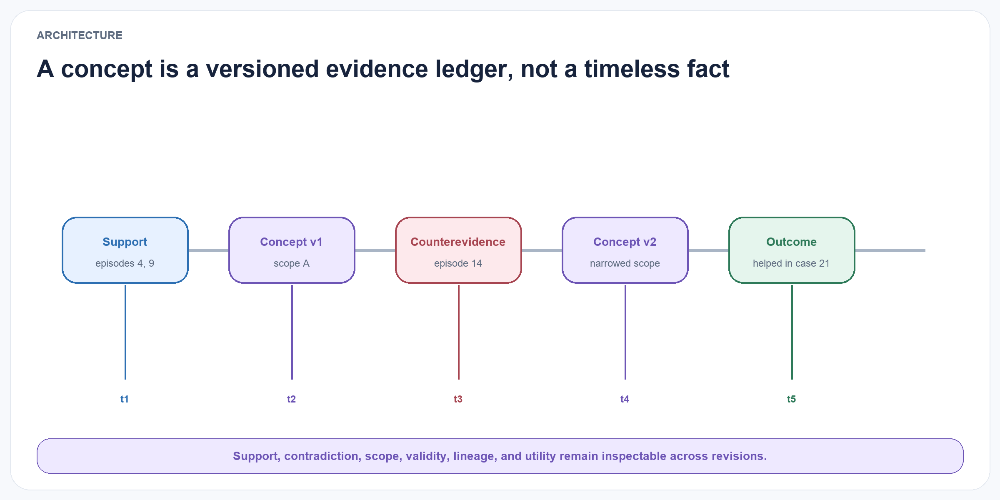
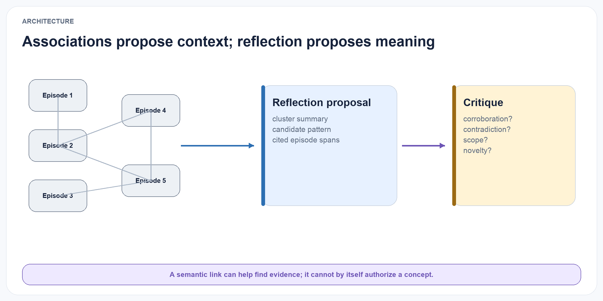
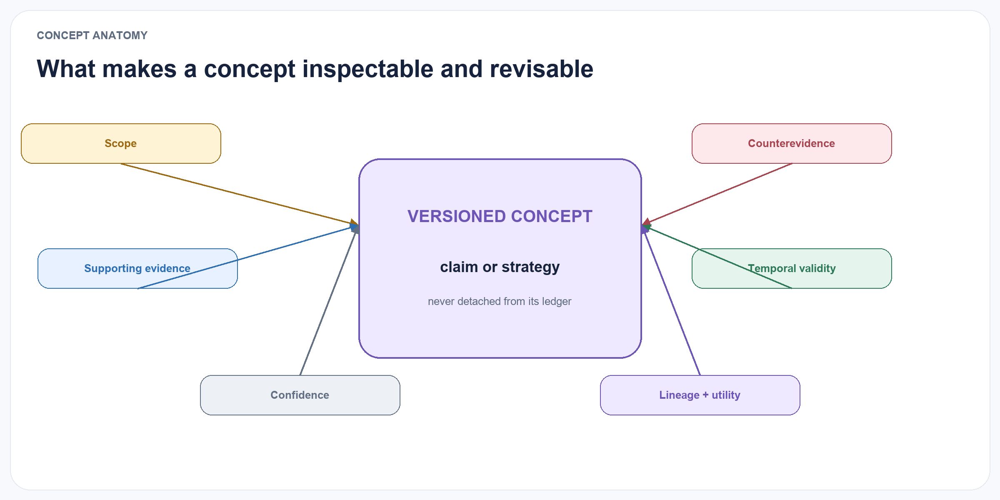
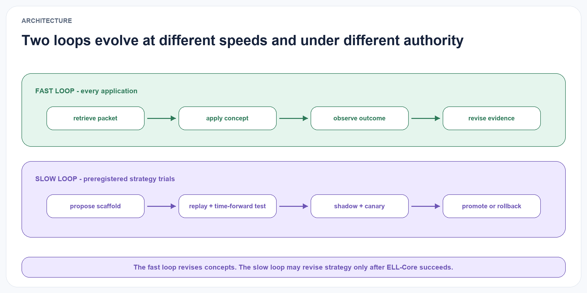
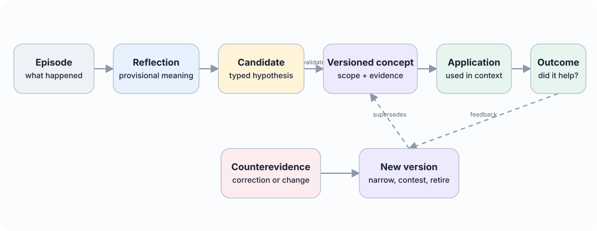
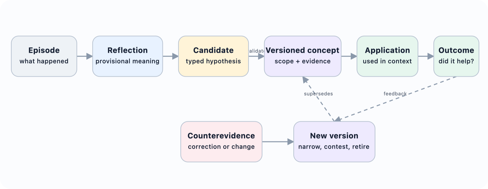

# Experience Learning Layer Architecture

::: {.content-visible when-format="html"}

:::

::: {.content-visible when-format="pdf"}

:::

ELL is organised as a write–associate–reflect–consolidate–apply–evaluate loop. Each component exposes a narrow interface so that models, stores, and retrieval methods can be replaced independently.

The architecture separates three concerns. The input and capture layer normalises consented chats, recordings, documents, tool traces, and connectors into immutable sources, events, and episodes. Replaceable memory and retrieval infrastructure stores or indexes projections for association and candidate generation. The canonical learning layer governs hypotheses, concepts, applications, outcomes, versioning, permissions, and deletion.

External memory services and indexes can propose candidates, but they do not define canonical truth, identity, policy, or learning state.

## ELL-Core and deferred extensions

The confirmatory system is deliberately small. ELL-Core contains seven durable objects: `SourceArtifact`, `Episode`, `Reflection`, `ConceptVersion`, `EvidenceLink`, `ApplicationReceipt`, and `Outcome`. `AuditEvent` records lifecycle operations. Associations may be computed ephemerally or stored as disposable projections. Skills, graphs, learned memory-operation policies, provider-specific memory objects, neural state, multimodal capture, and product clients are deferred extensions.

This boundary is methodological, not only architectural. If a concept layer cannot beat simple retrieval and direct-insight baselines with this minimum object set, adding a graph database, learned controller, or specialised vector index would make attribution harder rather than rescue the claim.

## Canonical episode store

{#fig-evidence-ledger fig-alt="A timeline links supporting evidence, a first concept version, counterevidence, a narrowed second version, and a later outcome." width="100%"}

The input is a canonical episode rather than an application-specific chat message. An episode is represented as e_i=(id_i,t_event_i,t_observed_i,x_i,o_i,a_i,y_i,s_i,p_i), where id_i is the episode identifier, t_event_i and t_observed_i are event and observation time, x_i is context, o_i is an observation, a_i is an action, yi is an outcome, si is source metadata, and pi contains privacy and access-control metadata. The two timestamps allow delayed reports and later corrections to be represented.

The raw episode store is append-only. Corrections create new records linked by relations such as corrects, supersedes, or retracts. This preserves an audit trail and prevents an abstraction process from silently rewriting its own evidence.

## Association layer

{#fig-association-reflection fig-alt="Connected episode nodes feed a reflection proposal and then a critique stage that checks corroboration, contradiction, scope, and novelty." width="100%"}

The optional association layer creates typed links between episodes. Initial relation types are:

- semantic similarity;
- shared entities or participants;
- temporal proximity or sequence;
- shared goal or task;
- shared action pattern;
- similar outcome;
- candidate causal relation;
- contradiction or correction.

Only some edges are objective. Temporal sequence and shared identifiers can be deterministic; causal and contradiction edges may be model-generated hypotheses. Every edge therefore records its method, score, model or rule version, and source evidence.

The layer supports both local neighbourhood retrieval and clustering. Reflection should not operate only on the nearest embeddings because lexically distant episodes may share a goal, failure pattern, or outcome. Hybrid candidate generation combines semantic, structural, temporal, and outcome-based signals. The first benchmark also includes lexical-only, vector-only, and deterministic gold-cluster conditions so the value of association is measured rather than presumed.

## Reflection Engine

A reflection is a provisional interpretation: r_j=(h_j,t_j,s_j,p_j,n_j,u_j,z_j).

Here hj is a claim or question, tj is reflection type, sj is scope, pj and nj are supporting and counterevidence episode sets, uj is uncertainty metadata, and zj is review status.

Reflection types include:

- observation or recurring pattern;
- causal hypothesis;
- strategy or procedural lesson;
- preference hypothesis;
- anomaly or exception;
- unresolved question;
- candidate correction to an existing concept.

The Reflection Engine is triggered by configurable events: a cluster reaching a minimum size, a repeated failure, a surprising outcome, new contradiction, elapsed time, or an explicit request. It produces structured output and is followed by an evidence-validation pass. Reflections may remain unverified, be marked supported, or be rejected before they reach the Concept Engine.

## Concept Engine

A concept is a reusable, versioned proposition or strategy: c_k^(v)=(q_k,s_k,a_k,i_k,p_k,n_k,g_k,t_k,v,z_k).

Here qk is the proposition, sk is scope, ak is a set of applicability conditions, ik is the expected implication or recommended behaviour, pk and nk are supporting and counterevidence sets, gk is confidence, tk is temporal validity, v is version, and zk is lifecycle state.

Concept types include descriptive patterns, user preferences, causal hypotheses, strategies, constraints, and procedural rules. An initial implementation should focus on textual concepts, but the schema permits executable procedures or references to code artefacts.

The Concept Engine performs five operations:

1. Propose: create a candidate concept from compatible reflections.
2. Merge: combine concepts that express the same claim and scope.
3. Split: separate an over-broad concept when evidence supports distinct conditions.
4. Revise: create a new version with changed claim, scope, validity, or confidence.
5. Retire or supersede: stop active use while preserving lineage.

Promotion requires evidence from more than one episode unless a domain-specific policy explicitly permits single-source facts. Evidence diversity is measured across time, source, participant, task, and surface form to reduce duplicate episodes being mistaken for independent support.

## Concept registry and evidence ledger

{#fig-concept-anatomy fig-alt="A versioned concept is surrounded by scope, supporting evidence, counterevidence, temporal validity, confidence, lineage, and utility." width="100%"}

The concept registry contains the current active version of each concept and its full version chain. The evidence ledger is append-only and records:

- which episodes supported or contradicted a reflection;
- which reflections contributed to a concept version;
- which model, prompt, rule, or human action produced a change;
- which concepts were retrieved for a decision;
- what action was taken and what outcome followed;
- deletions, access changes, and invalidations.

This ledger supports explanation and reproducibility. A user or evaluator should be able to ask: “Why does the system believe this?”, “What evidence disagrees?”, “When did this change?”, and “Did using it help?”

## Learning retrieval and application

At decision time, the retrieval service selects a mixture of concepts and source episodes. Concepts provide compact general guidance; episodes provide specificity, exception handling, and verification. The retrieval policy must be able to return either type independently.

A concept relevance score can initially be expressed as R(c,q)=w1 S1+w2 S2+w3 S3+w4 S4+w5 confidence(c)-w6 S6, where S1 through S4 represent semantic relevance, scope match, temporal validity, and observed utility; confidence(c) is concept confidence; and S6 is active contradiction. This formula is a design heuristic, not a validated scientific result. Weights will be tuned only on development data and frozen before test evaluation.

The retrieved package includes the concept statement, scope, confidence, current state, relevant support, relevant counterevidence, and source links. At the application boundary this compact, budgeted package is called an intuition packet. It may combine current concepts, selected episodes, procedures, open commitments, uncertainty, and known contradictions. It is a read object, not a new kind of memory. Applications can require a minimum confidence or allow contested concepts to be shown as uncertainty rather than instructions.

Formally, an intuition packet for query q, time t, policy context p, and budget b is I(q,t,p,b)=(C*,E*,A*,U*,X*,L*), where C* is the selected set of current concepts or hypotheses, E* is the minimum restored source evidence, A* contains applicable procedures or prospective commitments, U* is calibrated uncertainty, X* is material counterevidence or conflict, and L* is provenance and selection lineage. The packet is valid only if every item satisfies p, its estimated context cost does not exceed b, and its lineage resolves to permitted canonical records.

## Outcome loop

Every use of a concept creates an application record: am=( xm,Cm,Em,dm,ym,um) .

Here xm is the task context, Cm and Em are the concepts and episodes used, dm is the decision, ym is the observed outcome, and um is utility. Outcome feedback can come from task reward, user correction, validator output, or later observed consequences. The system must not automatically treat every positive result as proof of causality; outcomes are recorded as validation signals with their own reliability. Repeated success can strengthen a concept, while failure can add counterevidence, narrow scope, or trigger revision.

## Slow self-scaffolding loop

{#fig-fast-slow-loops fig-alt="A fast application loop is shown above a slower preregistered strategy-trial loop." width="100%"}

ELL separates learning about the world from learning how to perform that learning. The fast experience loop remains:

`episode → reflection → concept → application → outcome → revision`

The slower meta-learning loop is:

`receipts and outcomes → scaffold proposal → replay → shadow trial → canary → governed promotion or rollback`

A `LearningScaffold` is a proposed extension object with an immutable identifier, version, parent, task category, model and prompt identifiers, available operation schemas, reflection triggers, evidence-selection policy, consolidation and retrieval parameters, resource budgets, error-recovery rules, abstention policy, validity interval, and lifecycle state. Each `ApplicationReceipt` in a self-scaffolding experiment records the exact scaffold version, selected evidence and concepts, model and tool versions, action, independent outcome, and total cost. This creates an auditable credit-assignment path from a strategy to the behaviour it induced.

The self-scaffolding controller is never a canonical writer. It proposes bounded changes to the inner learning strategy. The outer constitution remains deterministic and immutable to the controller: source provenance, consent, workspace isolation, purpose and sensitivity checks, schema validation, temporal consistency, deletion cascades, canonical commit rules, audit retention, tool permissions, provider egress, sealed evaluation, and rollback authority. A scaffold that violates any of these constraints is ineligible regardless of task reward.

This loop is a deferred extension rather than part of ELL-Core. Recording scaffold identity in experimental receipts can begin earlier, but automated proposal, selection, and promotion do not enter the first confirmatory study.

## Lifecycle

::: {.content-visible when-format="html"}

:::

::: {.content-visible when-format="pdf"}

:::

The lifecycle is intentionally reversible. Corroborated does not mean permanently true. Contested concepts may still be retrieved when their uncertainty is relevant. Superseded concepts remain available for historical questions, while retired concepts are excluded from ordinary guidance.
