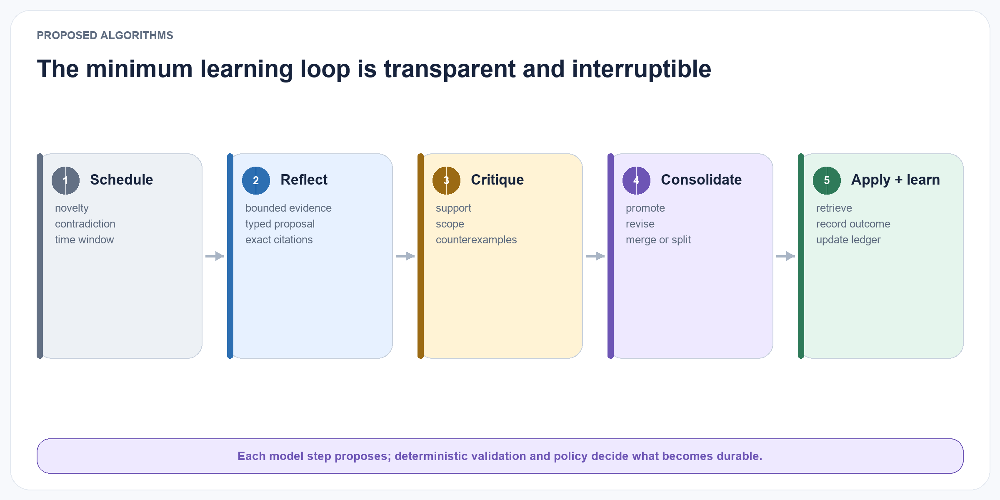
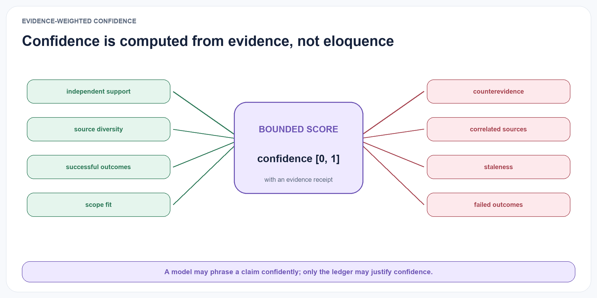
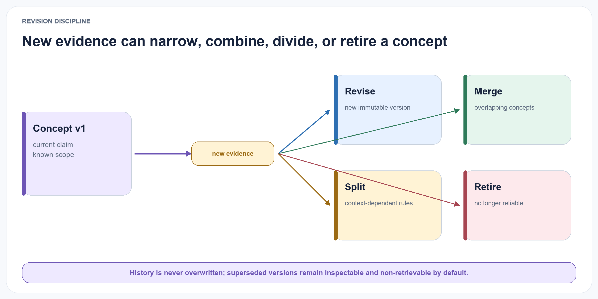
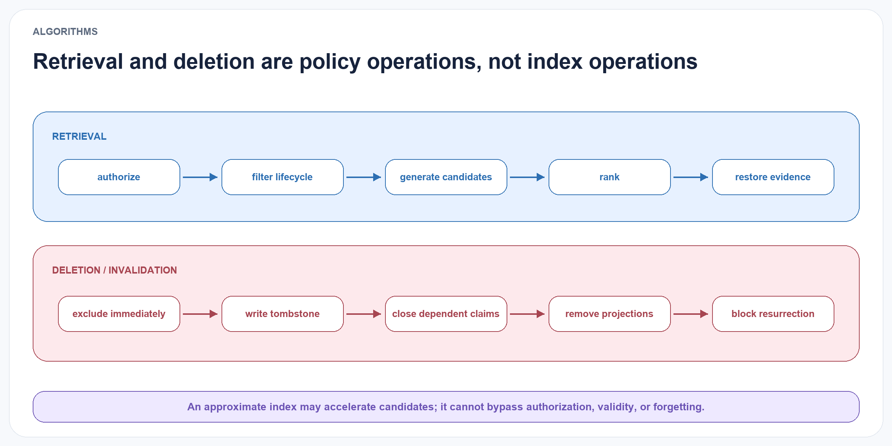

# Proposed Algorithms

## Minimum algorithm and comparison discipline

{#fig-algorithm-loop fig-alt="A five-stage algorithm moves from scheduling through reflection, critique, consolidation, and application with outcomes." width="100%"}

The first implementation favours transparent rules over an optimised end-to-end pipeline. Each stage must expose its candidate inputs, accepted outputs, rejected outputs, cost, and reason code. A more complex policy is added only after the simpler condition has a frozen baseline result. This ordering separates the value of the concept contract from the value of a particular embedding model, graph, reranker, or learned controller.

## Reflection scheduling

Running reflection after every episode would be expensive and may create redundant interpretations. ELL therefore uses event-based scheduling. An episode or cluster enters the reflection queue when one or more conditions are met:

- the cluster contains at least n distinct episodes;

- a failure or unusually high reward occurs;
- a new episode contradicts an active concept;
- association novelty exceeds a threshold;
- the concept has not been reviewed within a time window;
- a user or agent explicitly requests reflection.

The scheduler records why a job was triggered. This enables later analysis of whether a scheduling policy created useful concepts or unnecessary model calls.

## Reflection generation and critique

The Reflection Engine receives a bounded evidence packet: selected episodes, existing nearby reflections, relevant active concepts, and an instruction to produce typed hypotheses. The generator must output structured fields rather than a free-form essay.

A separate validation pass performs four checks: 1. Entailment: Does each cited episode actually support the claim attributed to it?

2. Contradiction: Are there nearby episodes that disagree?

3. Scope: Is the claim broader than its evidence?

4. Novelty: Is the reflection meaningfully different from existing reflections or concepts?

The validator can be an independent model, a deterministic rule, a human reviewer, or a combination. Using a separate model call does not guarantee independence, so experiments will include same-model and cross-model validation conditions.

## Concept proposal

Reflections are grouped by semantic compatibility and scope overlap. A proposed concept requires:

- at least m compatible reflections;
- at least d distinct supporting episodes;
- minimum evidence diversity;
- no unresolved high-confidence contradiction;
- an explicit scope and exception list;
- a concise proposition and expected implication.

The initial development policy will require support from at least three episodes across at least two distinct contexts. The threshold is not a claim about how many observations create knowledge. It is a preregistered control variable, swept only on development streams and frozen before the sealed test.

A simplified proposal procedure is: for each reflection cluster R: evidence = union(supporting episodes in R) counter = retrieve plausible counterevidence candidate = generate_concept(R, evidence, counter) checks = validate(candidate, evidence, counter) if checks pass promotion policy: register(candidate, state="proposed")

## Evidence-weighted confidence

{#fig-confidence-evidence fig-alt="Positive and negative evidence factors feed a bounded confidence score with an evidence receipt." width="100%"}

LLMs are not assumed to be calibrated judges of their own abstractions. ELL computes an operational confidence score from external features:

confidence(c)=1/(1+exp(-z_c)) , where zc is a weighted score that increases with supporting evidence, evidence diversity, and observed application utility, and decreases with counterevidence, age without revalidation, and validator disagreement.

The formula is deliberately transparent and will be calibrated on held-out development data. A fixed rule based on support, contradiction, and outcome counts is the mandatory baseline; logistic and Bayesian alternatives are secondary conditions. Confidence is never used to hide counterevidence, and it is not interpreted as a probability until calibration supports that interpretation. The raw counts and links remain visible.

## Revision and temporal validity

When new evidence conflicts with a concept, the system chooses among four responses:

- add exception: the core claim remains valid but has a narrower boundary;
- narrow scope: the concept was over-generalised;
- change validity interval: the pattern was true during one period but is no longer current;
- replace claim: a new concept version better explains the evidence.

Revision produces a new immutable version linked by revises or supersedes. The old version retains its former validity interval and applications. This design supports historical reasoning and avoids treating changed preferences or conditions as contradictions that must erase the past.

## Merge and split

{#fig-revision-paths fig-alt="A first concept and new evidence branch into revise, merge, split, and retire paths." width="100%"}

Duplicate concepts increase retrieval noise, while over-broad concepts hide meaningful exceptions. Merge candidates are identified using proposition similarity, overlapping evidence, compatible scope, and similar implications. Split candidates are triggered when counterevidence clusters around a coherent condition or when application outcomes differ significantly by context.

Both operations require a lineage record. A merge creates a new concept that references all parents. A split creates child concepts whose evidence partitions are explicit. Automated operations above a risk threshold can require human approval.

## Retrieval with evidence restoration

Concept retrieval follows two stages. The first stage selects concepts by semantic, structural, temporal, and utility signals. The second restores a small, query-specific set of source episodes. This prevents a compact concept from becoming an ungrounded instruction.

The retrieval budget is fixed in tokens or characters so that systems are compared under equal context cost.

This avoids rewarding a method merely for retrieving far more text. Results report both task utility and memory information density.

## Deletion and invalidation

{#fig-retrieval-invalidation fig-alt="Two process lanes show policy-bound retrieval and deletion-driven invalidation." width="100%"}

A user must be able to delete source data. Deletion cannot stop at the episode store because derived concepts may still encode the removed information. ELL maintains derivation links so a deletion request can:

1. remove or tombstone the source episode according to policy;
2. remove it from support and counterevidence sets;
3. recompute affected confidence values;
4. contest, revise, or retire concepts that no longer meet support thresholds;
5. record the deletion cascade without retaining prohibited content.

This is both a privacy requirement and a scientific requirement: provenance is incomplete if derived claims cannot be invalidated when their evidence disappears.

## Governed self-scaffolding extension

Ornith-1.0 suggests that the scaffold which elicits an agent's behaviour can itself be optimised jointly with task solutions (Ornith Team 2026). ELL adopts this as a second-order learning problem after the fixed-policy ELL-Core study. The initial implementation does not update model parameters. It searches over external, declarative `LearningScaffold` versions whose mutable fields are explicitly enumerated and schema-validated.

An initial scaffold trial proceeds as follows:

1. Select a task category and the current approved scaffold without exposing sealed outcomes.
2. Generate a small bounded set of typed mutations from the current scaffold and recorded development failures.
3. Reject candidates that change fields outside the sanctioned learning-policy surface.
4. Run multiple paired replays for each eligible candidate under identical sources, base model, tool surface, context budget, random seeds, and outcome opportunities.
5. Disqualify any trajectory that violates provenance, permission, deletion, evidence, tool, or evaluator-isolation invariants.
6. Compare the remaining candidates with the current scaffold on chronological development and out-of-time cases.
7. Run a selected candidate in shadow mode, then a category-limited canary with an explicit rollback target.
8. Promote it by creating a new immutable scaffold version, or retire it while preserving its proposal, trials, vetoes, costs, and rejection reasons.

The initial selection method is governed evolutionary search, not reinforcement learning: a model proposes several bounded mutations and deterministic experiment code selects among candidates after fixed gates. Contextual bandits or reinforcement learning become eligible only after application receipts provide sufficient independent, non-duplicated outcome evidence and a preregistered comparison justifies the additional opacity and cost.

Reward is evaluated only after hard governance gates. Eligible candidates are compared on time-forward task utility, structurally distant transfer, calibration, counterevidence and exception recall, correction latency, negative transfer, information density, and total write- plus read-path cost. Privacy leakage, cross-workspace access, unsupported sensitive inference, provenance loss, evaluator tampering, or incomplete deletion makes a trial ineligible rather than merely lowering a scalar score. A language-model judge may veto suspicious intent that deterministic rules cannot express, but it is frozen before evaluation and is never the sole reward source.

Policy staleness and evidence validity are kept separate. Outcomes collected under obsolete scaffold, model, prompt, or tool versions may be downweighted or excluded when estimating the value of a current scaffold. The underlying episodes are not weakened merely because they are old; their applicability is governed by valid time, observed time, correction, and explicit user evidence.
