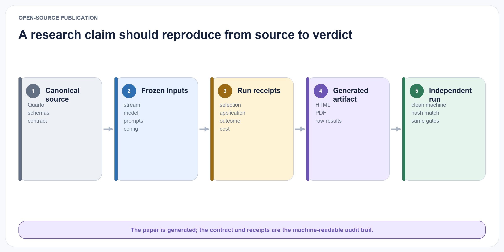

# Open-Source Research Publication

{#fig-reproducibility-chain fig-alt="A reproducibility chain links canonical source, frozen inputs, run receipts, generated artifacts, and independent replication." width="100%"}

## Licensing

The repository is released under the permissive MIT License. It covers the paper source, diagrams, documentation, publication tools, and synthetic examples unless a file states otherwise. Third-party datasets retain their original licences and are downloaded separately. A future archival research release should additionally include machine-readable citation metadata and generated dependency attribution.

## Repository structure

```text
experience-learning-layer/
├── README.md
├── LICENSE
├── _quarto.yml
├── styles.css
├── index.qmd
├── chapters/
│   └── assets/diagrams/
├── examples/
├── research/
├── schemas/v0.6/
├── src/ell/
├── tests/
├── pyproject.toml
├── Makefile
└── .github/workflows/publish.yml
```

The repository contains the living chapter sources, shared visual diagrams, synthetic lifecycle examples, machine-readable research contract, generated JSON Schemas, deterministic benchmark, in-memory governed core, and the small Quarto configuration required to produce the website and PDF. Generated publication and benchmark output is ignored and rebuilt locally or by GitHub Actions. The reference implementation is explicitly labelled pre-confirmatory so passing software checks cannot be mistaken for evidence that the research hypotheses are supported.

## Reproducibility requirements

Every reported experiment must include:

- immutable configuration files;
- exact Git commit;
- model identifiers and hashes where available;
- prompts and structured-output schemas;
- random seeds;
- hardware and serving configuration;
- raw outputs and failure logs;
- evaluation code and judge prompts;
- token, latency, and storage accounting.

A one-command small-scale reproduction should run on consumer hardware with a compact open model. Full benchmark results may require larger hardware, but the same code path and data format must be used.

## Contribution model

The project begins with a lightweight maintainer model and records its evolution through the manuscript and Git history. Contributions require reproducible publication checks, provenance for example or benchmark changes, and a declaration when generated data or code was produced with model assistance.

Research claims are reviewed separately from software changes. A faster implementation is not accepted as scientifically equivalent unless its behaviour and evaluation remain comparable.

## Private data boundary

{#fig-private-boundary fig-alt="A boundary separates public research artifacts from private experience, with explicit consent and aggregate-only crossings." width="100%"}

Private conversation exports can be used locally to test ingestion and qualitative usefulness, but they are not part of the public benchmark and must not be committed. Public experiments use synthetic or properly licensed data. This paper includes data-governance guidance; redaction hooks, local namespaces, and tested deletion cascades are required before any longitudinal pilot.
