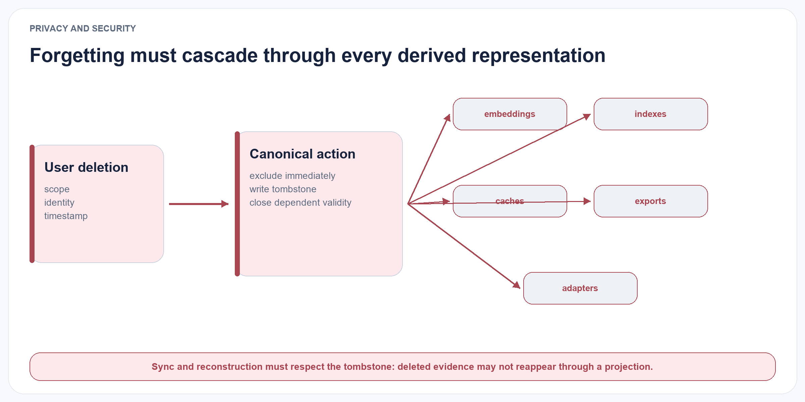
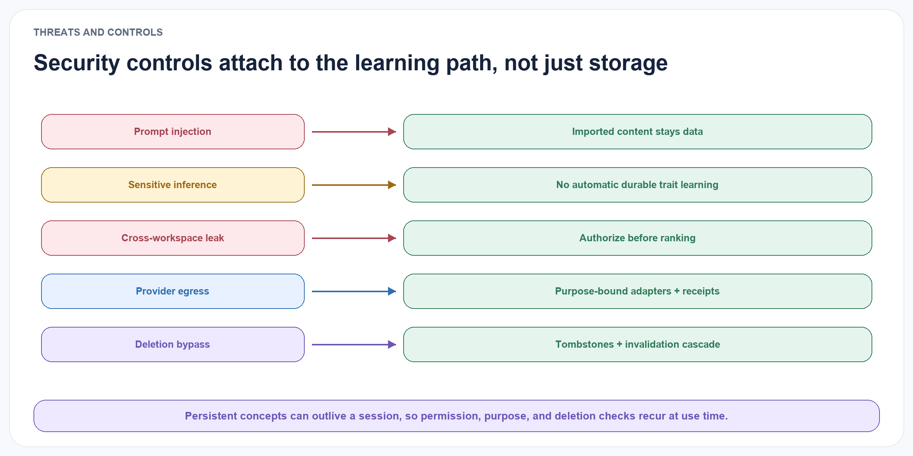

# Ethics, Privacy, and Security

A memory system can improve continuity while also increasing risk. Persistent concepts may encode sensitive information, amplify a mistaken interpretation, or influence actions long after the originating interaction.

Long-term memory is therefore a control channel, not merely a convenience layer. Research on trustworthy memory search similarly shows that semantically related memory can still be inappropriate or unsafe for the current task (Zhang et al. 2026).

ELL adopts the following principles.

Visibility. Users should be able to inspect active concepts, evidence, uncertainty, and change history.

Correction. A user correction is stored as high-priority evidence and can trigger immediate contestation, but it should not silently erase historical state when historical reasoning is required.

Deletion. Source deletion propagates to derived concepts. Derived content must not survive simply because it was transformed.

{#fig-privacy-cascade fig-alt="A user deletion triggers a canonical tombstone and invalidation across embeddings, indexes, caches, exports, and adapters." width="100%"}

Least access. Retrieval enforces source-level permissions and subject namespaces before semantic relevance is considered.

No hidden certainty. Contested or weak concepts are labelled. Confidence and evidence counts are not replaced by persuasive prose.

Poisoning resistance. New memories do not automatically become trusted rules. Promotion requires independent evidence and validators, and sensitive actions can require human approval.

Purpose limitation. Concepts formed for one domain are not automatically reused in another. Cross-domain transfer is an explicit, auditable operation.

Constitutional separation. A learned scaffold may propose bounded changes to reflection, consolidation, retrieval, budgets, retries, or abstention. It cannot change consent, permissions, workspace isolation, sensitivity rules, deletion, provider egress, evaluator isolation, canonical commit authority, or the evidence required to justify a memory. Governance failures disqualify a scaffold regardless of downstream reward.

{#fig-threat-controls fig-alt="Five security threats map to controls for imported content, sensitive traits, workspace authorization, provider egress, and deletion invalidation." width="100%"}

The system may still infer sensitive traits that were never stated directly. The research implementation therefore defaults to local processing, excludes sensitive-trait inference from public examples, and treats inferred personal concepts as user-governed data. Future work must test whether users can understand and meaningfully control these abstractions.
