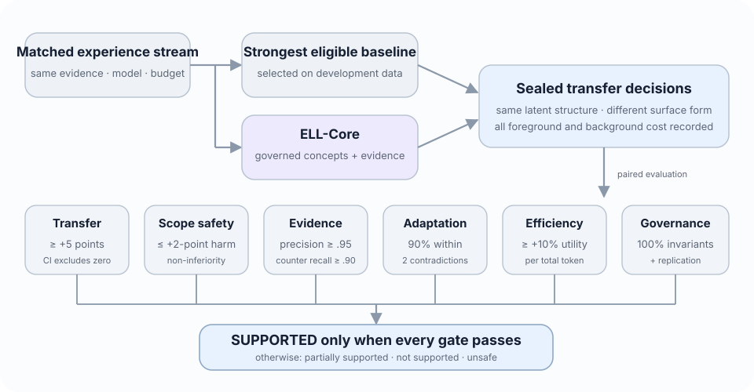
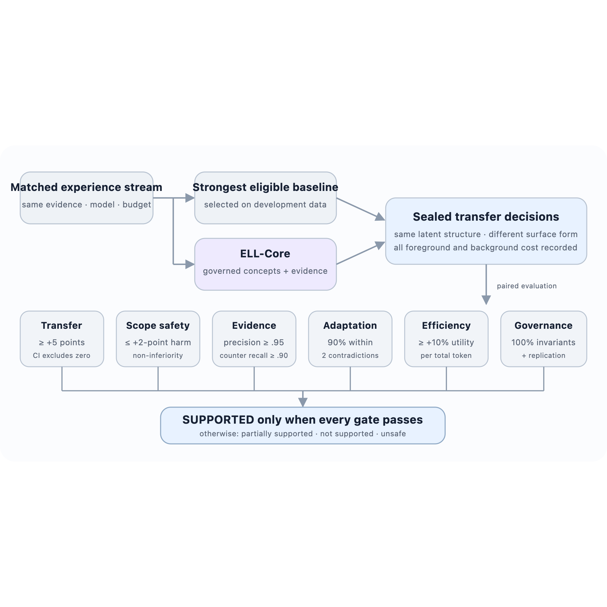

# Definition of Success and Falsifiability

## Decision rule

ELL-Core succeeds only if it improves future behaviour and passes every mandatory guardrail. Better-looking concepts, persuasive examples, high retrieval recall, or lower foreground prompt cost are insufficient on their own. The following thresholds are minimum practically important effects for the first confirmatory study, fixed before the sealed test is opened.

These thresholds are project decision rules, not universal standards for agent memory. The preregistration must justify them against benchmark variance, task difficulty, and the cost of each error before data collection begins.

::: {.content-visible when-format="html"}

:::

::: {.content-visible when-format="pdf"}

:::

| Gate | Measure | Pass rule |
|---|---|---|
| Primary transfer | Paired task-success difference on structurally related, lexically distant sealed cases | Point estimate at least **+5 percentage points** over the strongest eligible baseline and the paired 95% confidence interval excludes zero |
| Unsupported generalisation | Decisions that apply a concept outside its gold or adjudicated scope | Upper bound of the paired 95% confidence interval is less than a **+2-point non-inferiority margin** relative to the comparator |
| Evidence quality | Precision of cited support and recall of material counterevidence | Support precision at least **0.95** and counterevidence recall at least **0.90** on the controlled benchmark |
| Change adaptation | Delay after a gold change point or material correction | At least **90%** of affected concepts are contested or revised within two relevant contradictory episodes; post-change stale-guidance rate remains below **5%** |
| Cost efficiency | Task utility divided by all amortised input and output tokens | At least **10% higher utility per 1,000 total tokens** than the confirmatory comparator, including background work |
| Governance invariants | Workspace isolation, idempotency, lineage, deletion and projection invalidation | **100% pass** on deterministic and adversarial contract tests; no observed cross-workspace retrieval and no deleted evidence remaining reachable in tested projections |
| Replication | Sensitivity to model and task family | Primary transfer and unsupported-generalisation gates pass with two open model families; the transfer direction is also positive on at least one external cognitive or action benchmark |

The frozen v0.6 contract uses 640 paired sealed tasks per confirmatory condition. This exceeds the approximate 625 pairs required for 80% power under a two-sided 0.05 test, a five-point effect, and an assumed 0.20 discordant-pair rate. The primary interval is a 10,000-resample paired percentile bootstrap with a committed analysis seed. Predeclared corrupt source artifacts and duplicate task identifiers are the only eligible exclusions; provider failures remain scored failures with their traces retained.

## Outcome labels

**Supported.** Every gate passes, including the external replication gate. The paper may conclude that ELL-Core provides evidence for a useful governed concept layer under the tested conditions. A positive Phase 4 result before external replication is labelled *provisionally supported*, not supported.

**Partially supported.** Transfer improves, but one or more safety, adaptation, efficiency, governance, or replication gates fail. The paper must name the failed gate and cannot recommend the full architecture for deployment.

**Not supported.** The primary transfer gate fails, or the strongest simple baseline matches ELL at lower cost. Work should then focus on the winning simpler method, such as evidence-grounded retrieval, agent-controlled search, or direct insights.

**Unsafe.** A governance invariant fails. The affected configuration is ineligible for deployment regardless of average task performance.

## Product success is a later claim

After the confirmatory result, a product study may test whether people experience less repetition, better shorthand understanding, timely context, rapid correction, and trustworthy control. Product success requires blinded task evaluation and user research; it cannot be inferred from synthetic benchmark accuracy. The word *intuition* remains a product-level description of these behaviours, not the primary scientific outcome.

## Explicit rejection conditions

The central approach is weakened or rejected if:

- direct insight extraction or agent-controlled flat memory matches ELL at lower cost;
- concept metrics improve without improving held-out decisions;
- concept packets omit exceptions that raw episode retrieval preserves;
- gains disappear under equal total-compute accounting;
- revision causes unstable concept churn or slow recovery after change;
- results depend on one model family, one generator, or one evaluator;
- the system cannot invalidate derived state after deletion; or
- outcome feedback strengthens concepts without independent evidence that their use helped.

Negative results remain valuable. They can show that explicit concepts are unnecessary for some task classes, that consolidation should be triggered only by failures, or that governed evidence retrieval is more useful than concept formation.
