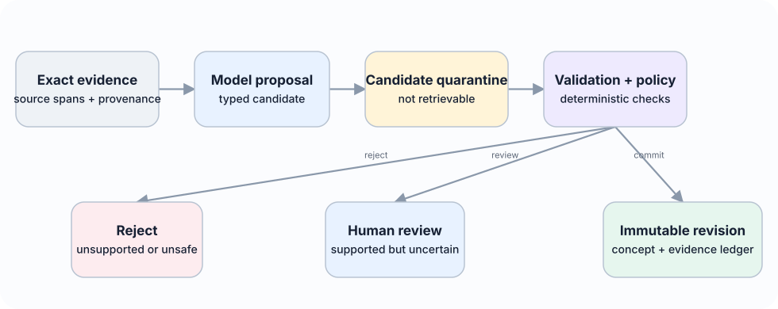
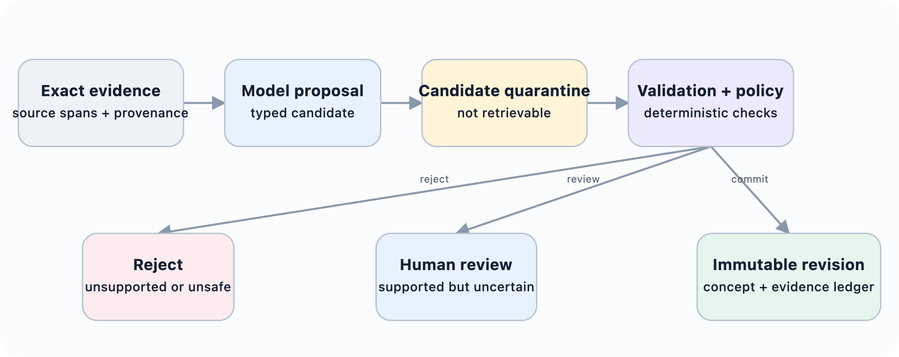
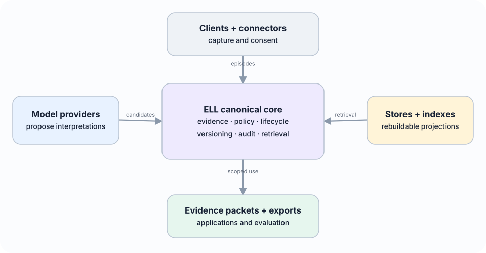
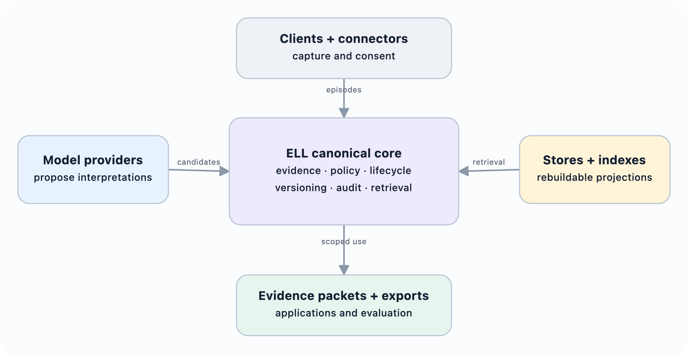

# Experience Learning Layer Expansion

The research architecture above asks whether evidence-grounded concepts improve transfer and future behaviour. This expanded architecture generalises the v0.1 scaffold into L: an open, local-first experience-learning layer usable by people, applications, and AI agents. The expansion does not replace the original empirical question. It makes the operational boundaries needed to test the hypothesis explicit.

L is not primarily a chatbot, note-taking application, Zettelkasten, vector database, or graph visualisation. Its north star is to give any AI a natural, evolving intuition about the user or organisation—grounded in experience, economical to use, sensitive to change, explainable when inspected, and always under user control. Its learning loop captures an experience, preserves its source, extracts typed candidates, decides under deterministic policy what may become durable, consolidates related memories without losing contradictions, retrieves the smallest useful context, observes outcomes, and revises future behaviour. Models interpret meaning and propose. Deterministic services validate, authorize, version, and commit.

Intuition is an emergent capability of this loop, not another row type or a claim that the system resembles a person. Evidence-grounded compression, prediction, association, relevance selection, temporal adaptation, and outcome feedback should together support shorthand, proactive just-in-time context, useful generalisation, rapid correction, change detection, calibrated uncertainty, and optional explanation. The delivery object is a compact intuition packet with sufficient evidence and uncertainty to be useful, plus stable references for deeper inspection.

## System layers and technology boundaries

The expanded architecture has three independently evolvable layers:

- input and capture adapters turn conversations, recordings, documents, application events, and future connectors into immutable source artifacts, normalized events, and bounded episodes;
- memory and retrieval infrastructure provides replaceable persistence, search, association, graph, vector, or hosted-memory projections;
- the canonical learning layer evaluates evidence, maintains temporal and probabilistic hypotheses, governs durable concepts, records applications and outcomes, and controls revision, contradiction, and forgetting.

None of these layers is implemented in the current paper repository. SQLite, hosted memory services, vector indexes, and graphs remain candidate adapters or projections to integrate and compare. The canonical learning layer is specified through proposed lifecycle contracts, but those contracts are not yet an operational closed learning loop. This distinction prevents an external memory system from silently becoming L’s truth or policy authority when implementation begins.

The proposed direction is immutable evidence plus dynamic, temporal, probabilistic concepts and hypotheses. Extraction, association, consolidation, retrieval, and forgetting policies should be pluggable and may become model-driven or learned. Their proposals remain subject to deterministic provenance, permissions, workspace isolation, deletion, schema, and canonical commit governance. No fixed graph, vector method, note-linking scheme, or model family is selected as the final architecture before the success criteria and ablations in Section 7 are run.

## Plural memory semantics

The v0.1 paper distinguishes episodes, reflections, concepts, applications, and outcomes. The broader ELL architecture retains these objects while distinguishing additional memory semantics that have different authority, lifetime, and retrieval rules:

- source memory preserves immutable artifacts and exact addressable spans;
- working memory holds expiring state for the current task or conversation;
- episodic memory represents bounded experiences, decisions, actions, and outcomes;
- semantic memory represents temporal assertions rather than timeless key-value pairs;
- preference memory represents scoped choices, exceptions, strength, and explicitness;
- procedural memory represents versioned workflows, preconditions, approvals, evidence, and rollback;
- prospective memory represents commitments, reminders, deadlines, and unresolved threads;
- relational memory represents evidence-backed temporal edges;
- reflective memory records uncertainty, freshness, usefulness, contradictions, and knowledge gaps;
- policy memory defines retention, consent, provider, sharing, and deletion boundaries and is never ordinary model context.

These forms may share infrastructure, but they must not be flattened into one untyped table with identical lifecycle semantics. The useful layer is the explainable connection between evidence and future behaviour, not a decorative node cloud.

## Source, event, and episode boundary

All provider connectors terminate at a common normalization boundary. An immutable SourceArtifact preserves source identity, checksums, timestamps, sensitivity, consent, and stable spans. Normalized ExperienceEvents represent user messages, assistant messages, tool calls and results, file changes, decisions, feedback, and external events. One or more events form a bounded Episode containing inputs, responses, actions, observations, and outcomes.

Stable deterministic identifiers make ingestion rerunnable. The same connector, external reference, source version, and source event produce the same domain IDs. Conversation exports, tool traces, calendar records, or future connectors can therefore be replaced without placing their schemas inside reflection, consolidation, policy, or retrieval services.

## Governed candidate and commit path

::: {.content-visible when-format="html"}

:::

::: {.content-visible when-format="pdf"}

:::

A model response is untrusted structured input. It enters a CandidateMemory quarantine and cannot participate in normal retrieval. Deterministic validation checks the schema, cited source and span existence, workspace access, sensitivity inheritance, temporal fields, allowed predicates, and referenced memories. Policy then selects one of three initial outcomes:

- explicit user statements, corrections, and user-confirmed candidates may commit after validation;
- supported ordinary inferences and inferred procedures wait for review;
- unsupported non-explicit claims and sensitive model inferences are rejected.

The commit service is the sole canonical writer. It uses idempotency keys and optimistic concurrency, writes an immutable revision, appends a content-minimized audit event, and schedules disposable projections. A correction creates a new memory and closes the validity of the superseded revision. It never rewrites history. A lower-authority inference cannot supersede explicit user evidence.

## Policy-bound evidence retrieval

Retrieval is a typed service rather than direct database or vector-index access. A request includes actor, purpose, workspace, scope, allowed memory types, maximum sensitivity, evidence preference, and a fixed context budget. Authorization and lifecycle filtering happen before relevance ranking. Superseded, forgotten, expired, cross-workspace, and sensitivity-incompatible records do not enter ordinary results.

Candidate generation may combine lexical search, vectors, relation neighbourhoods, time, pinning, procedures, and later learned rerankers. Exact-vector, HNSW, graph, and hosted memory adapters remain replaceable projections to benchmark; no index or provider is canonical memory. The response is an EvidencePacket, presented at the application boundary as an intuition packet, containing selected current claims, scoped preferences, episodes, procedures, commitments, citations, selection explanations, uncertainty, and known material contradictions. A compact concept never becomes a naked instruction detached from its source.

Concrete comparison adapters may wrap Graphiti/Zep temporal graphs, Mem0 extraction and retrieval, Letta-style context management, or TencentDB Agent Memory's layered local store. Learned-policy adapters may implement AgeMem-style tool actions, AtomMem-style atomic operations, or MemSkill-style evolving routines. Experience and skill adapters may provide EXG-style graphs, ReasoningBank-style strategies, or lifecycle-managed skill candidates. Neural accelerators may provide Titans-, HOPE-, or TMEM-style state. In every case, the adapter returns candidates or acceleration state; proposed canonical SourceArtifact, CandidateMemory, and MemoryRecord contracts, together with proposed SkillVersion, ApplicationReceipt, and deletion records, remain governed by ELL.

## Local-first and provider-neutral topology

::: {.content-visible when-format="html"}

:::

::: {.content-visible when-format="pdf"}

:::

A complete usable state can live on one device. Network absence must not prevent capture, browsing, correction, or lexical retrieval. Remote processing visibly degrades to local processors or queued work. A practical reference adapter may use SQLite, content-addressed encrypted files, FTS5, and a replaceable vector index, but these technologies do not define the domain.

Four authentication concerns remain separate: L user identity, workspace authorization, model-provider credentials, and connector grants. A model adapter may call a provider API; a client or agent may call L through a narrow protocol; or L may export a scoped context bundle. Provider credentials never define L identity, canonical records, or access policy.

Forgetting immediately excludes a record, writes a tombstone, removes projections, and triggers evidence-aware invalidation. Sync must not resurrect tombstoned content. Sensitive trait inference is disabled for automatic durable learning. Imported documents are untrusted content, never system instructions. Secrets do not enter prompts, canonical memory, exports, analytics, or logs.
