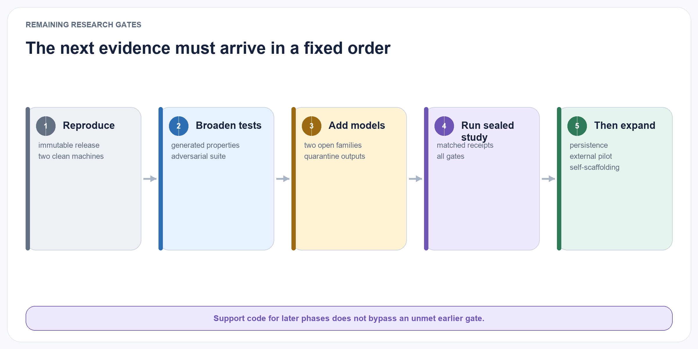

# Research Artifact Status

The repository contains the publication plus a deterministic Phase 0–2 reference artifact. It does not yet contain model-assisted learning, governed self-scaffolding, or confirmatory results. The implementation makes the proposed contracts executable without presenting passing unit tests as evidence for H1–H7.

{#fig-artifact-status fig-alt="A status board marks phases zero to two implemented, phase three not yet implemented, phase four blocked, phases five and six support-only, phase seven specification-only, and all hypotheses without empirical results." width="100%"}

## Canonical and generated editions

The Quarto Markdown chapters are the sole canonical publication source. The versioned JSON research contract and schemas are the canonical machine-readable experiment boundary. A single `quarto render` derives the multi-page HTML reading edition and downloadable PDF and copies the contract artifacts into the published site. Quarto provides navigation, search, section numbering, cross-format links, and publication metadata. Generated output is ignored by Git and rebuilt locally or by the GitHub publishing workflow, keeping ordinary paper edits small and reviewable.

## Synthetic lifecycle examples

The repository includes a small synthetic JSONL collection covering explicit scoped preferences, single-event inference, unsupported claims, sensitive inference, explicit correction, material contradiction, temporal change, Dutch evidence, prompt injection embedded in imported content, deletion cascades, permission revocation, derived-state invalidation, and cross-workspace retrieval. These cases make proposed policy outcomes concrete for readers. They are examples, not benchmark results, and no empirical result is inferred from them.

## Executable reference slices

Draft 2020-12 JSON Schemas are generated from strict runtime contracts for the eight canonical objects, cost and run traces, learning packets, invalidation reports, evaluator judgments, and benchmark records. A machine-readable v0.6 research contract states the estimand, gates, baseline-selection rule, power assumptions, exclusions, sealed-seed handling, and cost boundary. **It is superseded and does not freeze them:** v0.6 powered only the primary gate, sized the study from an unjustified discordance default, and treated clustered tasks as independent. v0.7 supersedes it as the accepted design direction but is internally inconsistent on sizing, so it is not frozen either. A v0.8 contract is in preparation.

The Phase 1 slice generates deterministic chronological train, development and sealed streams with paired tasks. **Tier sizes are deliberately not stated here and are `null` in the contract:** they are empirical outputs of the frozen instrument, derived from between-rule variance on development, and the counts quoted in earlier drafts no longer describe the generator. Streams include support, contradiction, scoped exceptions, correlated evidence, change points, delayed outcomes, permission denials, deletions, distractors, and sealed-seed commitments. It implements no-memory, maximum-context, BM25, exact-vector, fused-retrieval and direct-insight conditions, plus a battery of signal-free null policies used to detect leakage. `rolling-summary` was reclassified from comparator to null policy after recency selection proved to be a covert rule oracle. Every task produces a run manifest, selected-record trace, application receipt, evaluator judgment, and cost trace. Development generation does not materialise the sealed partition.

The Phase 2 slice provides an in-memory deterministic ELL-Core. It validates exact source spans, requires quarantined reflections to pass review, commits immutable concept versions with evidence links, preserves revision lineage, enforces workspace and purpose grants before retrieval, records applications and independently sourced outcomes, rejects conflicting idempotent retries, and invalidates dependent canonical and projection state after deletion. It has no LLM, graph, vector service, hosted memory, or learned policy dependency.

## Remaining gates

{#fig-remaining-gates fig-alt="A five-stage gate sequence moves from reproduction to broader tests, model assistance, sealed study, and only then expansion." width="100%"}

Phase 0 requires an immutable tag or archival release of a contract that is internally consistent; neither v0.6 nor v0.7 qualifies, and there are currently no tags or releases. Phase 1 requires reproductions across **independent seeds that vary structure**, not merely two clean machines on the same seed — same-seed byte-identity verifies determinism, which was never in doubt, and until 11 August 2026 the seed varied only surface text, so that criterion was trivially satisfiable and is not evidence of generalisation. Phase 2 requires broader generated/property testing and an exit report showing every derived object resolves to permitted source evidence across the full adversarial suite. Persistent-store rebuilds, provider egress enforcement, job recovery, and substrate crash recovery remain Phase 5 concerns rather than prerequisites for the in-memory Phase 2 slice.

Phase 3 is the next implementation step only after those exits are independently reviewed. It adds structured generation from two open model families, keeps every output quarantined until deterministic validation, and freezes prompts and policies on development data before any sealed run.

Phase 4–6 support code is present without bypassing that sequence. The confirmatory runner returns a blocked report until the frozen prerequisites and matched sealed receipts exist. The substrate suite currently compares in-memory and SQLite canonical semantics plus lexical and exact-vector projection behavior; optional TurboVec and external-memory adapters are unavailable and barred from canonical writes. External benchmark adapters require local licence-declared, hash-matched packages, while the pilot authority requires a ready protocol and active purpose-specific consent. No Phase 4 verdict, Phase 5 performance comparison, external benchmark result, or human-pilot claim exists.

Phase 7 is a research specification only. The paper defines the proposed scaffold objects, immutable outer boundary, replay and time-forward comparison, shadow and canary sequence, promotion and rollback rules, and mandatory failure gates. No scaffold schema, proposal controller, trial runner, adaptive policy, or deployment authority has been implemented.

The project does not advance merely because an implementation exists. It advances when the primary transfer result and every mandatory guardrail in Section 11 pass. If a simpler approach matches ELL at lower cost, the research plan explicitly adopts that simpler method and records the concept-layer hypothesis as unsupported for the tested conditions.

## Instrument status, 11 August 2026

This section is updated as work lands, so a reader can see the current state without
reconstructing it from commits.

**The measuring instrument was rebuilt and is now trustworthy on two of three strata.** A review on
11 August found four leakage paths by which a policy could score without learning, a scoring stage
that discarded roughly 94% of the evidence it was issued, and a generator whose random seed varied
surface text but not structure — which had made the sealed partition structurally identical to the
development partition. Each is repaired. Every revision, what it invalidated and who found it is
recorded in `research/GENERATOR_REVISION_LOG.md`.

Notably, none of the four leaks was an illegitimate field. Each was a join between individually
defensible fields, and all four survived code review and were caught only by measurement. The
boundary is therefore now specified in terms of information about the latent rule rather than as a
field allowlist, and a battery of signal-free null policies runs continuously.

**The answer stage is frozen** at digest `sha256:6fbd052b…`, enforced by a test that fails on any
edit, so instrument floors and ceilings cannot be silently revalued. **Pass marks are fixed**: the
q99.9 of each seed and stratum's permuted-null distribution, computed per seed and never pooled,
with the method ruled before any number was computed. On the primary far stratum the worst-seed mark
is 0.586310 and the smallest corridor after reserving the 0.05 target effect is 0.140476.

### Two blockers before any result exists

**No ELL condition is wired into the benchmark.** The contract names `ell-core-no-consolidation` and
`ell-core-full`; neither exists as a runnable condition. `ell.core` implements the lifecycle —
episodes, quarantined reflections, review, versioned concepts, evidence resolution, applications,
outcomes and deletion closure — and is tested, but it has never been connected to the benchmark as a
policy that can be scored. The system under test has not yet taken the test.

**No eligible comparator is robust on the primary stratum.** Across eight structural seeds the four
eligible comparators clear their pass mark on `near` (0.61–0.63 against 0.577) but sit at chance on
`far` (0.455–0.497 against a null mean of 0.4931). This is not a defect in the comparators. `far` is
defined as *zero content-word overlap with the supporting evidence*, and every eligible comparator
ranks by query-to-text overlap, so they are blind there by construction. An instrument-acceptance
criterion requiring one of them to land mid-band on `far` was therefore unsatisfiable as written.

That leaves an open question the project will not paper over: whether `far` is solvable by **any**
non-oracle method that is not ELL itself. If it is not, then an acceptance criterion on that stratum
is circular — the instrument would only be valid if the hypothesis were true. A self-managed
flat-file comparator is being implemented as the decisive test, and the interpretation of both
outcomes was recorded before the measurement was taken.

### What is claimed

Nothing. **No empirical result exists and none of H1–H7 has been tested.** The instrument is in
better condition than it was, which is a statement about the instrument and not about ELL.
