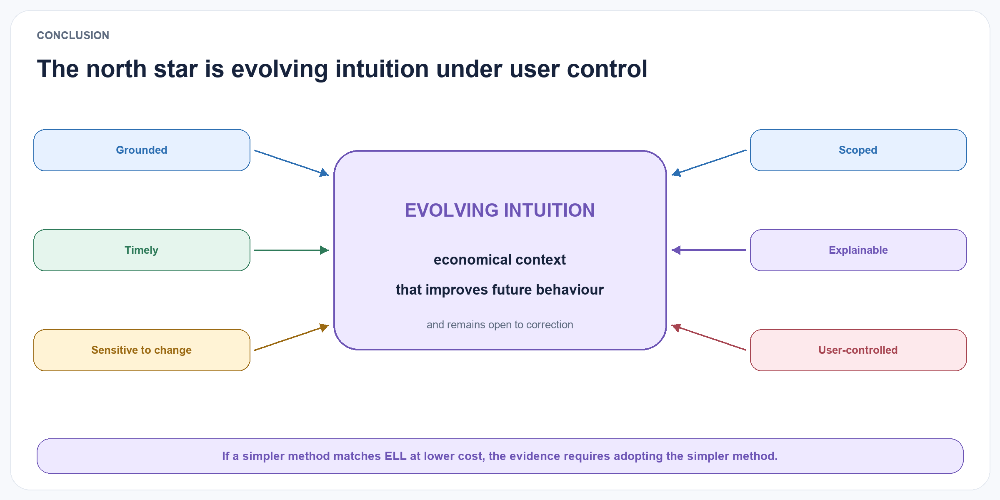

# Conclusion

The Experience Learning Layer begins from a simple distinction: access to old experience is not the same as learning from it. Current research already demonstrates reflection, dynamic memory organisation, schema induction, concept graphs, and semantic or procedural abstraction. The next useful contribution is therefore a stricter account of how an abstraction earns trust, remains connected to evidence, changes when challenged, and improves future behaviour.

{#fig-north-star fig-alt="Evolving intuition sits at the centre of grounded, timely, change-sensitive, scoped, explainable, and user-controlled properties." width="100%"}

ELL proposes an explicit path from episodes to provisional reflections, from reflections to versioned concepts, and from concepts to measured applications and outcomes. The architecture preserves both support and counterevidence, treats scope and temporal validity as first-class fields, and makes revision reversible and auditable. Its value will be determined empirically, not by the plausibility of the design.

The practical expression of that hypothesis is economical, timely context that helps an AI understand shorthand and adapt to change without hiding where its guidance came from. The scientific claim is narrower: under matched models, streams, and total compute, ELL-Core must improve sealed structurally distant transfer by at least five percentage points over the strongest eligible baseline while passing every safety, evidence, adaptation, cost, governance, and replication gate. The term *intuition* is deferred to later product research.

If ELL-Core earns that foundation, the next learning question is whether ELL can improve not only its concepts but the scaffold by which it forms and applies them. The proposed second-order loop treats reflection, evidence selection, consolidation, retrieval, budgets, retries, and abstention as versioned experimental policy while keeping provenance, consent, permissions, deletion, canonical commits, evaluators, and rollback outside learned control. This is a separate falsifiable programme, not permission for unrestricted self-modification and not a way to rescue a failed core result.

The project is open by default. The paper, diagrams, synthetic examples, and reproducible reading editions make the proposal easy to inspect, criticise, and extend. The immediate next step is the benchmark, not a product or a more elaborate architecture. If direct insight extraction, agent-controlled flat memory, or evidence-grounded retrieval matches ELL at lower cost, that result should replace the present design rather than be explained away.
