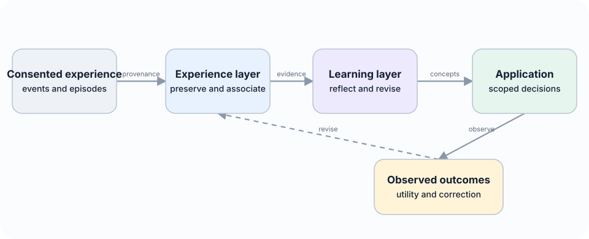
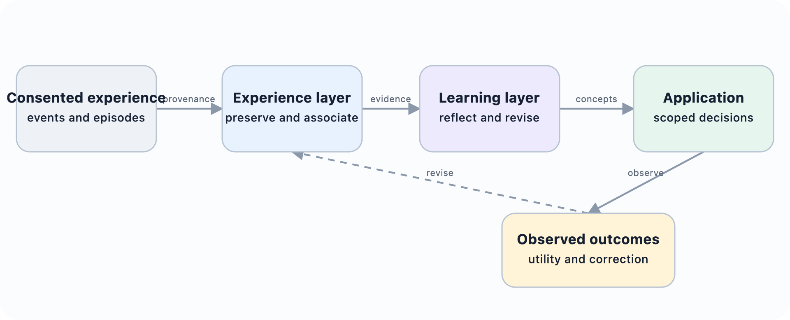

# Abstract {.unnumbered}

::: {.callout-note title="Living working draft v0.5 - 9 August 2026"}
Version 0.5 presents ELL as a paper-first open research project, adds a visual HTML reading edition and shared architecture diagrams, and narrows the repository to the manuscript, reproducible publication tools, and synthetic examples. Earlier drafts remain available through Git history.

**Research status.** This document is a working architecture paper and preregistered evaluation plan. It defines the proposed system, hypotheses, data model, implementation contract, and experiments. It does not report empirical results. Results will be added only after the open implementation and evaluation harness can reproduce them.
:::

Large language model agents can store and retrieve previous interactions, yet retrieval alone does not establish that an agent has learned from experience. Learning requires a system to identify patterns across episodes, distinguish observations from hypotheses, form reusable concepts, apply those concepts in new situations, and revise them when later evidence disagrees. Recent agent-memory research has introduced reflection, experience-derived insights, workflow induction, dynamic memory graphs, semantic and procedural memory, schema induction, and temporally grounded updates. The remaining challenge is therefore not simply to add another memory store, but to make the transition from experience to general knowledge explicit, inspectable, revisable, and directly measurable.

This paper proposes the Experience Learning Layer (ELL), an open, model-independent architecture positioned between an agent’s experience history and its decision process. ELL preserves raw episodes in an append-only store, creates typed associations between them, represents reflections as provisional interpretations, and promotes compatible reflections into versioned concepts. Each concept records its scope, supporting evidence, counterevidence, confidence, temporal validity, lineage, and observed utility. Concepts can be corroborated, contested, revised, superseded, or retired without erasing their evidential history.

The system north star is to give any AI a natural, evolving intuition about the user or organisation: grounded in experience, economical to use, sensitive to change, explainable when inspected, and always under user control.

Here intuition is neither anthropomorphism nor a new memory category. It names an emergent system capability produced by evidence-grounded compression, prediction, association, relevance selection, temporal adaptation, and outcome feedback. At use time, ELL should supply a compact intuition packet rather than dump raw history into a model, while retaining links that permit inspection, correction, deletion, and uncertainty-aware expansion.

The paper contributes a typed architecture, a concept-lifecycle protocol, an evidence ledger, an experimental benchmark for controlled concept induction, and a reproducibility plan based on openly licensed code and open-weight models. The central hypothesis is that separating reflection from concept consolidation, while preserving support and counterevidence, will improve transfer to structurally similar situations and reduce unsupported generalisation compared with episode-only retrieval or direct summarisation. The proposal is deliberately falsifiable: concept correctness, evidence coverage, revision behaviour, transfer, downstream task success, calibration, and cost are all measured independently.

*Keywords: agent memory; experiential learning; reflection; concept formation; semantic memory; continual learning; provenance; language agents; open source*

::: {.content-visible when-format="html"}

:::

::: {.content-visible when-format="pdf"}

:::
